<!-- This file is autogenerated. DO NOT EDIT. -->

# Polymath-Core Audit


* [1 Summary](#1-summary)
  * [1.1 Audit Dashboard](#11-audit-dashboard)
  * [1.2 Audit Goals](#12-audit-goals)
  * [1.3 System Overview](#13-system-overview)
  * [1.4 Key Observations/Recommendations](#14-key-observationsrecommendations)
* [2 Issue Overview](#2-issue-overview)
* [3 Issue Details](#3-issue-details)
  * [3.1 SecurityToken contract should always be initialized](#31-securitytoken-contract-should-always-be-initialized)
  * [3.2 Unpredictable behavior due to front running or general bad timing](#32-unpredictable-behavior-due-to-front-running-or-general-bad-timing)
  * [3.3 Polymath can arbitrarily change prices during a `USDTieredSTO` token sale](#33-polymath-can-arbitrarily-change-prices-during-a-usdtieredsto-token-sale)
  * [3.4 No new ST can be created after implementation upgrade](#34-no-new-st-can-be-created-after-implementation-upgrade)
  * [3.5 ModuleRegistry - Custom modules can block their own removal](#35-moduleregistry---custom-modules-can-block-their-own-removal)
  * [3.6 Transfer decisions by default should be consistent](#36-transfer-decisions-by-default-should-be-consistent)
  * [3.7 ModuleRegistry - Custom module verification should be bounded to module version](#37-moduleregistry---custom-module-verification-should-be-bounded-to-module-version)
  * [3.8 ModuleRegistry - Risks of allowing custom modules in the system](#38-moduleregistry---risks-of-allowing-custom-modules-in-the-system)
  * [3.9 `_balanceOfByPartition` function returns wrong value](#39-_balanceofbypartition-function-returns-wrong-value)
  * [3.10 `_returnPartition` function of SecurityToken always returns UNLOCKED partition](#310-_returnpartition-function-of-securitytoken-always-returns-unlocked-partition)
  * [3.11 `partitionsOf` function always returns empty array](#311-partitionsof-function-always-returns-empty-array)
  * [3.12 Security token upgrade info should be editable](#312-security-token-upgrade-info-should-be-editable)
  * [3.13 VestingEscrowWallet - Integer Underflow and unchecked array access in `pushAvailableTokensMulti()`](#313-vestingescrowwallet---integer-underflow-and-unchecked-array-access-in-pushavailabletokensmulti)
  * [3.14 SecurityTokenRegistry does not inherit from `ISecurityTokenRegistry`](#314-securitytokenregistry-does-not-inherit-from-isecuritytokenregistry)
  * [3.15 Different implementations for the same modifier `whenNotPausedOrOwner `](#315-different-implementations-for-the-same-modifier-whennotpausedorowner-)
  * [3.16 SecurityToken - security token name change may cause inconsistency](#316-securitytoken---security-token-name-change-may-cause-inconsistency)
  * [3.17 Where possible, a specific contract type should be used rather than `address`](#317-where-possible-a-specific-contract-type-should-be-used-rather-than-address)
  * [3.18 SecurityToken - Missing Input Validation `changeName`](#318-securitytoken---missing-input-validation-changename)
  * [3.19 `deleteDelegate` should be implemented without array iteration in permission manager](#319-deletedelegate-should-be-implemented-without-array-iteration-in-permission-manager)
  * [3.20 Improve Code Reusability - Use const variables instead of literals for EIP-1066 status codes.](#320-improve-code-reusability---use-const-variables-instead-of-literals-for-eip-1066-status-codes)
  * [3.21 TokenLib - Unused Import `KindMath`](#321-tokenlib---unused-import-kindmath)
  * [3.22 Module - authentication modifier `onlyFactoryOwner` and `onlyFactoryOrOwner ` are never used](#322-module---authentication-modifier-onlyfactoryowner-and-onlyfactoryorowner--are-never-used)
  * [3.23 SecurityToken - authentication modifier `onlyTokenFactory` is never used](#323-securitytoken---authentication-modifier-onlytokenfactory-is-never-used)
  * [3.24 SecurityToken/STGetter (ERC1643) getAllDocuments - can be cause gas or memory issues if used](#324-securitytokenstgetter-erc1643-getalldocuments---can-be-cause-gas-or-memory-issues-if-used)
  * [3.25 PolyToken - events are redefined in the implementation](#325-polytoken---events-are-redefined-in-the-implementation)
  * [3.26 Use latest stable version of Solidity](#326-use-latest-stable-version-of-solidity)
  * [3.27 `OwnedProxy` should be removed](#327-ownedproxy-should-be-removed)
  * [3.28 `Module.takeUsageFee()` allows admins to drain a module&#x27;s approved POLY tokens](#328-moduletakeusagefee-allows-admins-to-drain-a-modules-approved-poly-tokens)
  * [3.29 Redundant `pause` and `unpause` functions in `TransferManager`](#329-redundant-pause-and-unpause-functions-in-transfermanager)
  * [3.30 Modules shouldn&#x27;t be casted to `IBoot`](#330-modules-shouldnt-be-casted-to-iboot)
  * [3.31 `public` functions in `TokenLib` could be `external` instead](#331-public-functions-in-tokenlib-could-be-external-instead)
  * [3.32 `EtherDividendCheckpoint` and `ERC20DividendCheckpoint` division by zero](#332-etherdividendcheckpoint-and-erc20dividendcheckpoint-division-by-zero)
  * [3.33 `SecurityToken` / `STGetter` storage layout is hard to maintain](#333-securitytoken--stgetter-storage-layout-is-hard-to-maintain)
  * [3.34 `LockUpTransferManager._removeLockUpFromUser` checks for an impossible condition](#334-lockuptransfermanager_removelockupfromuser-checks-for-an-impossible-condition)
* [4 Threat Model](#4-threat-model)
  * [4.1 Overview](#41-overview)
  * [4.2 Security Stories](#42-security-stories)
* [5 Tool-Based Analysis](#5-tool-based-analysis)
  * [5.1 Mythril](#51-mythril)
  * [5.2 Harvey](#52-harvey)
  * [5.3 Ethlint](#53-ethlint)
  * [5.4 Surya](#54-surya)
* [6 Test Coverage Measurement](#6-test-coverage-measurement)
  * [6.1 Test Coverage observations](#61-test-coverage-observations)
* [7 Business Logic Review v2.2.0 to v3.0.0 Modules](#7-business-logic-review-v220-to-v300-modules)
* [Appendix 1  - File Hashes](#appendix-1----file-hashes)
* [Appendix 2  - Severity](#appendix-2----severity)
  * [A.2.2 - Minor](#a22---minor)
  * [A.2.3 - Medium](#a23---medium)
  * [A.2.4 - Major](#a24---major)
  * [A.2.5 - Critical](#a25---critical)
* [Appendix 3  - Disclosure](#appendix-3----disclosure)


## 1 Summary

ConsenSys Diligence conducted a security audit on the Polymath Core smart contracts that comprise a system for launching regulatory-compliant securities tokens on a decentralized blockchain. 


### 1.1 Audit Dashboard
________________

#### Audit Details

* **Project Name: Polymath-Core**
* **Client Name: Polymath Inc.**
* **Client Contact: Adam Dossa**
* **Lead Auditor: Martin Ortner**
* **Co-auditors: Sergii Kravchenko, Steve Marx**
* **Date: 13 May 2019**
* **Commit Hash: #7a70aa5 (tag/3.0.0-audit)**
* **Repository: https://github.com/PolymathNetwork/polymath-core/releases/tag/3.0.0-audit**

#### Number of issues by severity

| | **Minor** | **Medium** | **Major** | **Critical** |
|:-------------:|:-------------:|:-------------:|:-------------:|:-------------:|
| **Open** | **0** | **0** | **0** | **0** |
| **Closed** | **20** | **3** | **7** | **4** |

________________

### 1.2 Audit Goals

The focus of the audit was to verify that the smart contract system is secure, resilient and working according to its specifications. The audit activities can be grouped in the following three categories:  

**Security:** Identifying security related issues within each contract and within the system of contracts.

**Sound Architecture:** Evaluation of the architecture of this system through the lens of established smart contract best practices and general software best practices.

**Code Correctness and Quality:** A full review of the contract source code. The primary areas of focus include:

* Correctness
* Readability
* Sections of code with high complexity
* Improving scalability
* Quantity and quality of test coverage

### 1.3 System Overview

#### Documentation

The following documentation was available to the audit team:

* [Documentation](https://github.com/PolymathNetwork/polymath-core/tree/dev-3.0.0/docs)
* [Core Specification](./documentation/)

#### Detail

This section outlines the top-level contracts and libraries of the system. A summary of the inheritance structure for the main component groups is given in the [Design](#design) section. A complete view of the inheritance structure can be found [here](./tool-output/surya/inheritance.png) ([dot](./tool-output/surya/inheritance.dot)). The complete call-graph is too large to be rendered as an image and is therefore only provided as a [graphviz dot file](./tool-output/surya/callgraph.dot).

##### Registries

- PolymathRegistry
- FeatureRegistry
- ModuleRegistry and ModuleRegistryProxy
- SecurityTokenRegistry, STRGetter and SecurityTokenRegistryProxy

##### Oracle Interfaces

- MakerDAOOracle
- StableOracle
- PolyOracle

##### SecurityToken

- SecurityTokenFactory (STFactory)
  - SecurityToken, STGetter and SecurityTokenProxy

##### Modules 

###### CheckPoint

- ERC20DividendCheckpoint, -Factory and -Proxy 
- EtherDividendCheckpoint, -Factory and -Proxy 
- WeightedVoteCheckpoint, -Factory and -Proxy 
- PLCRVotingCheckpoint, -Factory and -Proxy 
  
###### SecurityTokenOffering (STO)

- CappedSTO, -Factory, -Storage and -Proxy
- USDTieredSTO, -Factory, -Storage and -Proxy
- PresaleSTO, -Factory, -Storage and -Proxy
  
###### TransferManager

- BlacklistTransferManager, -Factory, -Storage and -Proxy
- CountTransferManager, -Factory, -Storage and -Proxy
- GeneralTransferManager, -Factory, -Storage and -Proxy
- LockupTransferManager, -Factory, -Storage and -Proxy
- ManualApprovalTransferManager, -Factory, -Storage and -Proxy
- PercentageTransferManager, -Factory, -Storage and -Proxy
- VolumeRestrictionTransferManager, -Factory, -Storage and -Proxy

###### Wallet

- VestingEscrowWallet, -Factory, -Storage and -Proxy

###### PermissionManager

- GeneralPermissionManager, -Factory, -Storage and -Proxy

#### Scope

The scope of the audit was defined as the Solidity code in the `./contracts/` folder except

* Experimental modules (`contracts/modules/Experimental`)
* Migrations
* Mocks (`contracts/mocks`)
* External (`contracts/external`)
* Helpers (`contracts/helpers`)

The list of files and their hashes can be found in [Appendix 1 - File Hashes](#appendix-1----file-hashes).

In addition to the v3.0.0 audit the team also reviewed the three v2.2.0 modules to match their v3.0.0 counterparts. Details can be found in the section [Business Logic Review v2.2.0 to v3.0.0 Modules](#7-business-logic-review-v220-to-v300-modules).

#### Design

The system is a framework to launch and manage security tokens. An end user typically creates a new security token by registering a token symbol and deploying a security token contract. A security token can make use of one or more modules that specify the behavior of the token.

The system consists of three major component groups:

- **Registries**

    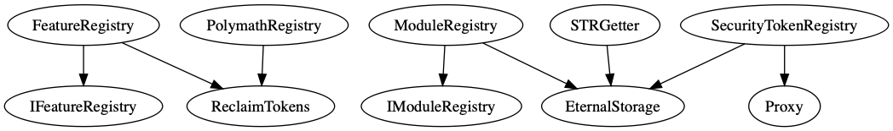<sub>([dot](./tool-output/surya/registries_inheritance.dot))</sub>

    Registries are administered and deployed by Polymath and form the backbone of the system. There are four Registries:

    - SecurityTokenRegistry

      The `SecurityTokenRegistry` is the main entry point to the protocol and allows token *issuers* to register symbols and generate new security tokens. It keeps track of all security tokens and links issuers to security tokens and the symbols they reserved.

      The `SecurityTokenRegistry` is proxied and can be upgraded. Ownership remains with Polymath.

      Main Functionality:

      * manage symbols: create, modify, and remove tickers and transfer their ownership
      * manage security tokens: generate and modify security tokens
      * manage fees: handle fees for ticker registration and security token launch

    - ModuleRegistry

      The `ModuleRegistry` keeps track of all registered modules that are available to security tokens and provides access to the module factories.

      The `ModuleRegistry` is proxied and can be upgraded. Ownership remains with Polymath.

      Main Functionality:

      * manage modules: register, remove, verify, unverify, and access modules

    - FeatureRegistry

      The `FeatureRegistry` supports enabling and disabling features in the system. It maps a feature name to a boolean value indicating whether that feature is enabled. In the audited code, the only feature tracked is called `customModulesAllowed`. This feature is checked by the `ModuleRegistry` to see whether custom modules (those not managed by Polymath) should be allowed.

      The `FeatureRegistry` is not proxied and cannot be upgraded. Ownership remains with Polymath.

      Main Functionality:

      * manage features: globally enable and disable features

    - PolymathRegistry

      The `PolymathRegistry` is the main registry that keeps track of core components of the system including the addresses of the `PolyToken` (e.g. used in the fee system), the `ModuleRegistry`, the `FeatureRegistry`, and the `SecurityTokenRegistry`.

      The `PolymathRegistry` is not proxied and cannot be upgraded. Ownership remains with Polymath.

      Main Functionality:

      * manage core components: set and change the address of core components.
      
      
    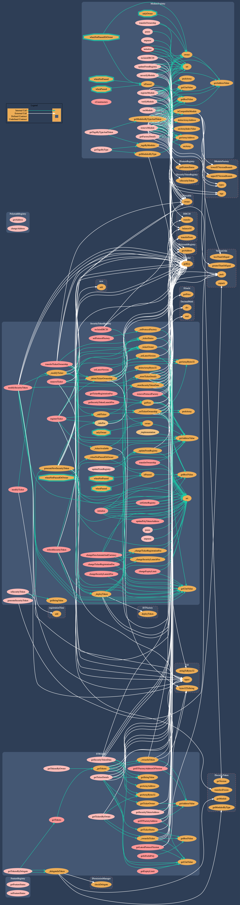<sub>([dot](./tool-output/surya/registries_graph.dot))</sub>


- **SecurityToken**

    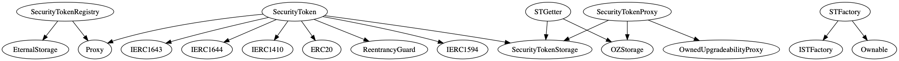<sub>([dot](./tool-output/surya/securitytoken_inheritance.dot))</sub>

    This is the central component of the system which implements [ERC 1400](https://github.com/ethereum/EIPs/issues/1400), also known as the [Security Token Standard](https://thesecuritytokenstandard.org/), which is comprised of a group of standards that aim to create a representation of securities on the Ethereum blockchain. It is compatible with [ERC 20](https://github.com/ethereum/EIPs/issues/20) and [ERC 777](https://github.com/ethereum/EIPs/issues/777) and includes: 

    - [ERC 1410 - Partially Fungible Token Standard](https://github.com/ethereum/EIPs/issues/1410)
    - [ERC 1594 - Core Security Token Standard](https://github.com/ethereum/EIPs/issues/1594)
    - [ERC 1643 - Document Management Standard](https://github.com/ethereum/EIPs/issues/1643)
    - [ERC 1644 - Controller Token Operation Standard](https://github.com/ethereum/EIPs/issues/1644)

    Security Tokens can have modules attached to them. Modules control the Security Tokens behavior and might have special capabilities or permissions in the system. 

    To issue a new `SecurityToken` an issuer interfaces with the `SecurityTokenRegistry` to register a symbol and generate a new security token. The `SecurityTokenRegistry` defines which factory (`STFactory`) is used to deploy a new `SecurityTokenProxy` linked to a specific implementation of the `SecurityToken`. The `SecurityTokenFactory` by default adds a data store and default transfer manager module (unless no defaults are set) and sets the treasury wallet address for the security token. The issuer may then attach other modules to the security token.

    The `SecurityToken` is proxied and can be upgraded.  
    Ownership of the SecurityTokenFactory (`STFactory`) and logic contracts (`SecurityToken` implementation) remains with Polymath.
    Ownership of the security token (`SecurityTokenProxy`) is finally transferred to the `issuer`.

    Main Functionality:

    * manage modules: add, remove, archive, unarchive, and upgrade modules
    * manage the security token: update token details and name, upgrade the token
    * manage security token transfers: transfer, freeze, and unfreeze transfers
    
    <sub>([dot](./tool-output/surya/securitytoken_graph.dot))</sub>


- **Modules**

    Modules control the security token's behavior and can have special capabilities or permissions in the system.
    
    The system comes with five types of modules:

    - TransferManager
    
        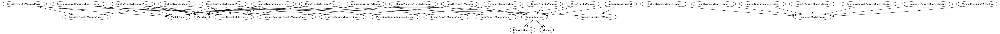<sub>([dot](./tool-output/surya/modules_transfermanager_inheritance.dot))</sub>

        A transfer manager controls the transfer of tokens.
        The following variants of transfer managers are provided by Polymath:

        - BlacklistTransferManager - prevent certain investors from transferring tokens during issuer-defined blackout periods
        - CountTransferManager - only allow up to a specified number of token holders
        - GeneralTransferManager - enforces whitelists, KYC, and other restrictions
        - LockupTransferManager - specify named lockup periods for certain investors
        - ManualApprovalTransferManager - transfers can only be made if pre-approved by token admin
        - PercentageTransferManager - limit the percentage of total tokens that can be owned by a single account
        - VolumeRestrictedTransferManager - limit the number of tokens that can be owned by a single account
        
        <sub>([dot](./tool-output/surya/modules_transfermanager_graph.dot))</sub>

    - PermissionManager
    
        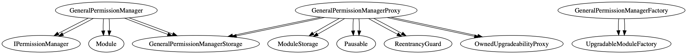<sub>([dot](./tool-output/surya/modules_permissionmanager_inheritance.dot))</sub>
        
        The follow variants of permission managers are provided by Polymath:

        - GeneralPermissionManager - allows the issuer to add wallets as delegates and gives permissions to use restricted functions on other modules
  
    - CheckPoint

        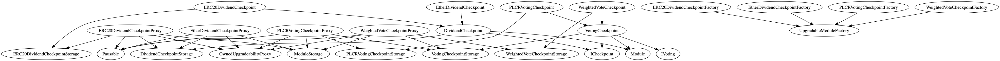<sub>([dot](./tool-output/surya/modules_checkpoint_inheritance.dot))</sub>
        
        CheckPoint modules keep track of and make use of historical token balances.

        - DividendCheckpoint Modules

            Creates checkpoint when dividends are paid so token holders are paid proportionally according to the token balance they held at the time the dividend was created.

            The system provides two variants of DividendCheckpoint modules: An `ERC20DividendCheckpoint` and an `EtherDividendCheckpoint.`
        
        - VotingCheckpoint Modules

            Allow the token owner to create ballots for voting, where voting weights are determined by the token balances of each voter at the time the vote was created.

            - WeightedVoteCheckpoint

                Basic weighted vote checkpoint module.

            - PLCRVotingCheckpoint

                The partial-lock commit/reveal (PLCR) vote uses a commit/reveal scheme to keep votes private during the voting period. Votes are revealed when voting has completed.              
        
        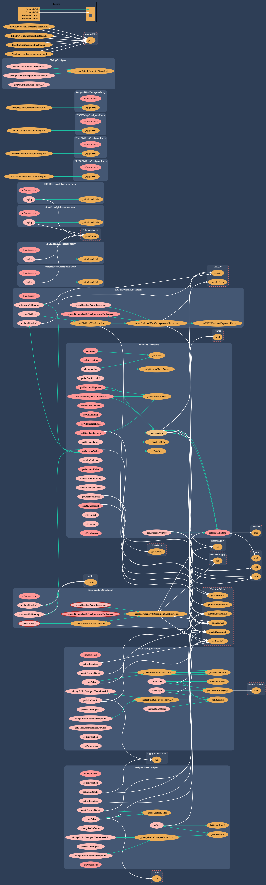<sub>([dot](./tool-output/surya/modules_checkpoint_graph.dot))</sub>

    - SecurityTokenOffering
    
        <sub>([dot](./tool-output/surya/modules_sto_inheritance.dot))</sub>

        SecurityTokenOffering modules allow security tokens to be issued in return for investment in various currencies (ETH, POLY and USD stable coin)

        - PresalesSTO - private presales


        - USDTieredSTO - price of token is specified in US dollars, with multiple price tiers


        - CappedSTO - sets a limit on the funding that is accepted and tokens that will be distributed
        
        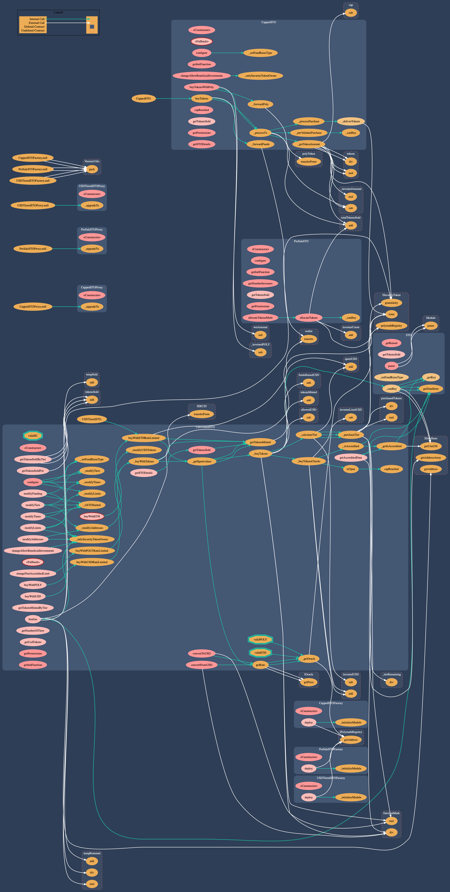<sub>([dot](./tool-output/surya/modules_sto_graph.dot))</sub>

    - Wallet
    
        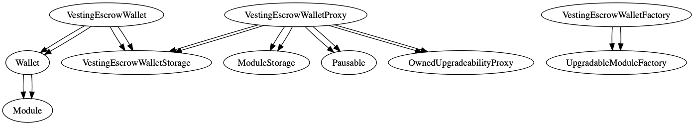<sub>([dot](./tool-output/surya/modules_wallet_inheritance.dot))</sub>

        The system provides a `VestingEscrowWallet` by default that allows approved staff to create a token vesting schedule for employees/affiliates.
        
        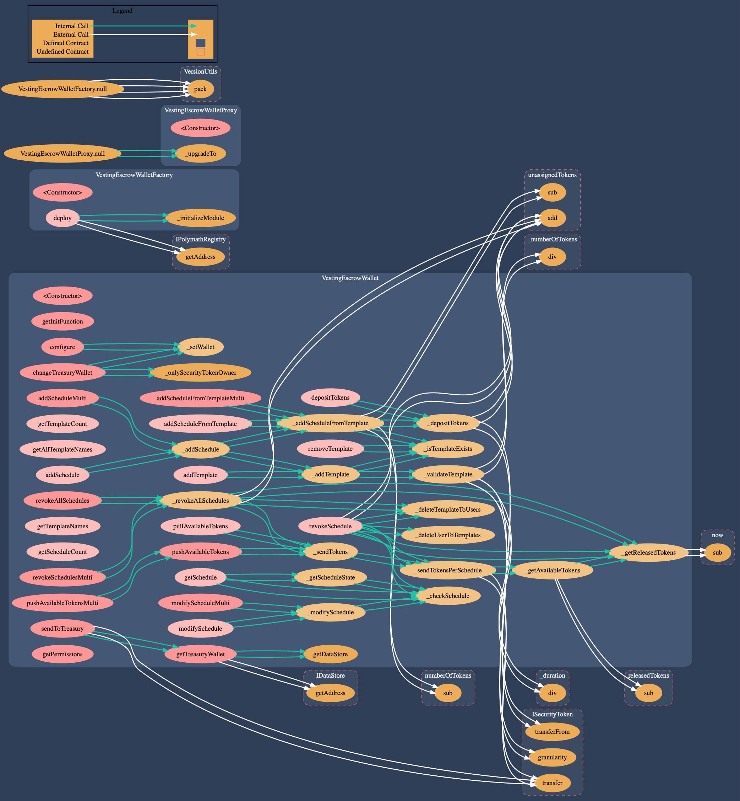<sub>([dot](./tool-output/surya/modules_wallet_graph.dot))</sub>

- **Oracles**
  
  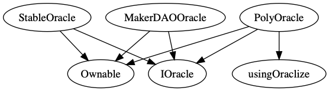<sub>([dot](./tool-output/surya/oracles_inheritance.dot))</sub>
  
  Oracles are a trusted entity in the system. Polymath wraps the oracles in order to allow a manual price override or to freeze the price. For example, oracles are used with STO modules to convert USD prices into POLY or ether.
  
  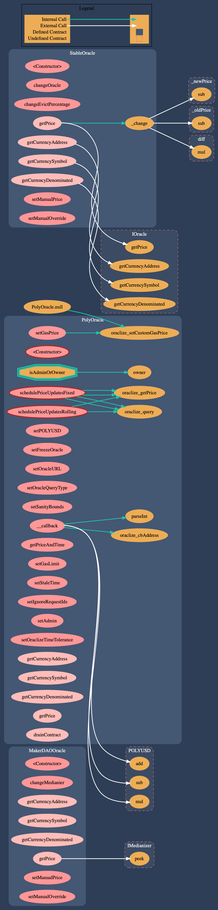<sub>([dot](./tool-output/surya/oracles_graph.dot))</sub>

### 1.4 Key Observations/Recommendations  

#### Positive observations

- Best practices are followed where they make sense.
- Common design patterns are used where required instead of inventing new interfaces and designs.
- The token is following the ERC1400 Security Token Standard.
- An extensive test-suite with 1544 individual tests is provided with the framework.
- Arithmetic operations are performed using `SafeMath`.
- Smart contracts are split into multiple files, most of them being comprised of an interface and an implementation. Common functionality is provided by library contracts. 
- Inline documentation for methods and classes is available and describes functionality and input parameters.
- The codebase did not yield compiler [warnings](./tool-output/truffle/truffle_compile.md) that were in scope for this audit.
- The project provided easy to use scripts (`npm`/`package.json`) for flattening relevant contracts, executing the test-suite and generating coverage statistics.

#### Opportunities for improvement

- Test coverage is incomplete. Any contract system that is used on the main net should have as a minimum requirement a 100% test coverage especially with a risk profile of a Security Token Network. In particular it's useful to include negative test cases ensuring that undesirable changes are detected early and kept in-line with the specification. Security focused test cases verifying that permissions are set-up according to the security-specification and trust-model should be consistently implemented. Methods that require special permissions must be tightly covered. None of the contracts that comprise the contract system should be exempt from testing/coverage. Please not that having a 5% rate of uncovered statements can easily mean that a couple of hundred statements are uncovered for large projects, potentially including critical code paths as well.
- High Complexity. A multiple library/contract system is complex in nature. The Polymath system consists of a high number of individual contracts that need to be deployed and maintained. The inter-contract communication rate is high. The inheritance model of the system is complex.
- The projects `npm run flatten-all` script does not flatten all relevant modules.
- Improve the Documentation. Inconsistencies exist between the [specification documents](#documentation) provided during the audit as well as the projects [wiki](https://github.com/PolymathNetwork/polymath-core/wiki).

It is recommended to fix all the issues listed in the following chapters, at the very least the ones with severity Critical, Major and Medium.

Individual issues are listed below, but it's important to note that the contract system is quite large, with complex proxying, upgradeability mechanisms, exponential combinations of modules, and insufficient testing. This means that **there are likely vulnerabilities in the system that our team did not find**. In addition to existing hidden vulnerabilities, new modules or upgrades to existing components could easily create new vulnerabilities. Fortunately, the administrative control retained by Polymath and token issuers will make it possible to recover from many types of vulnerabilities once discovered.

## 2 Issue Overview

The following table contains all the issues discovered during the audit. The issues are ordered based on their severity. More detailed description on the levels of severity can be found in the Severity Definitions Appendix. The table also contains the status of any discovered issue.

| Chapter      | Issue Title             | Issue Status | Severity    |
|:------------:| ----------------------- |:------------:|:-----------:|
| 3.1  | [SecurityToken contract should always be initialized](#31-securitytoken-contract-should-always-be-initialized) | Closed  | Critical |
| 3.2  | [Unpredictable behavior due to front running or general bad timing](#32-unpredictable-behavior-due-to-front-running-or-general-bad-timing) | Closed  | Critical |
| 3.3  | [Polymath can arbitrarily change prices during a `USDTieredSTO` token sale](#33-polymath-can-arbitrarily-change-prices-during-a-usdtieredsto-token-sale) | Closed  | Critical |
| 3.4  | [No new ST can be created after implementation upgrade](#34-no-new-st-can-be-created-after-implementation-upgrade) | Closed  | Critical |
| 3.5  | [ModuleRegistry - Custom modules can block their own removal](#35-moduleregistry---custom-modules-can-block-their-own-removal) | Closed  | Major |
| 3.6  | [Transfer decisions by default should be consistent](#36-transfer-decisions-by-default-should-be-consistent) | Closed  | Major |
| 3.7  | [ModuleRegistry - Custom module verification should be bounded to module version](#37-moduleregistry---custom-module-verification-should-be-bounded-to-module-version) | Closed  | Major |
| 3.8  | [ModuleRegistry - Risks of allowing custom modules in the system](#38-moduleregistry---risks-of-allowing-custom-modules-in-the-system) | Closed  | Major |
| 3.9  | [`_balanceOfByPartition` function returns wrong value](#39-_balanceofbypartition-function-returns-wrong-value) | Closed  | Major |
| 3.10  | [`_returnPartition` function of SecurityToken always returns UNLOCKED partition](#310-_returnpartition-function-of-securitytoken-always-returns-unlocked-partition) | Closed  | Major |
| 3.11  | [`partitionsOf` function always returns empty array](#311-partitionsof-function-always-returns-empty-array) | Closed  | Major |
| 3.12  | [Security token upgrade info should be editable](#312-security-token-upgrade-info-should-be-editable) | Closed  | Medium |
| 3.13  | [VestingEscrowWallet - Integer Underflow and unchecked array access in `pushAvailableTokensMulti()` ](#313-vestingescrowwallet---integer-underflow-and-unchecked-array-access-in-pushavailabletokensmulti) | Closed  | Medium |
| 3.14  | [SecurityTokenRegistry does not inherit from `ISecurityTokenRegistry`](#314-securitytokenregistry-does-not-inherit-from-isecuritytokenregistry) | Closed  | Medium |
| 3.15  | [Different implementations for the same modifier `whenNotPausedOrOwner `](#315-different-implementations-for-the-same-modifier-whennotpausedorowner-) | Closed  | Minor |
| 3.16  | [SecurityToken - security token name change may cause inconsistency](#316-securitytoken---security-token-name-change-may-cause-inconsistency) | Closed  | Minor |
| 3.17  | [Where possible, a specific contract type should be used rather than `address`](#317-where-possible-a-specific-contract-type-should-be-used-rather-than-address) | Closed  | Minor |
| 3.18  | [SecurityToken - Missing Input Validation `changeName`](#318-securitytoken---missing-input-validation-changename) | Closed  | Minor |
| 3.19  | [`deleteDelegate` should be implemented without array iteration in permission manager](#319-deletedelegate-should-be-implemented-without-array-iteration-in-permission-manager) | Closed  | Minor |
| 3.20  | [Improve Code Reusability - Use const variables instead of literals for EIP-1066 status codes.](#320-improve-code-reusability---use-const-variables-instead-of-literals-for-eip-1066-status-codes) | Closed  | Minor |
| 3.21  | [TokenLib - Unused Import `KindMath`](#321-tokenlib---unused-import-kindmath) | Closed  | Minor |
| 3.22  | [Module - authentication modifier `onlyFactoryOwner` and `onlyFactoryOrOwner ` are never used](#322-module---authentication-modifier-onlyfactoryowner-and-onlyfactoryorowner--are-never-used) | Closed  | Minor |
| 3.23  | [SecurityToken - authentication modifier `onlyTokenFactory` is never used](#323-securitytoken---authentication-modifier-onlytokenfactory-is-never-used) | Closed  | Minor |
| 3.24  | [SecurityToken/STGetter (ERC1643) getAllDocuments - can be cause gas or memory issues if used](#324-securitytokenstgetter-erc1643-getalldocuments---can-be-cause-gas-or-memory-issues-if-used) | Closed  | Minor |
| 3.25  | [PolyToken - events are redefined in the implementation](#325-polytoken---events-are-redefined-in-the-implementation) | Closed  | Minor |
| 3.26  | [Use latest stable version of Solidity](#326-use-latest-stable-version-of-solidity) | Closed  | Minor |
| 3.27  | [`OwnedProxy` should be removed](#327-ownedproxy-should-be-removed) | Closed  | Minor |
| 3.28  | [`Module.takeUsageFee()` allows admins to drain a module&#x27;s approved POLY tokens](#328-moduletakeusagefee-allows-admins-to-drain-a-modules-approved-poly-tokens) | Closed  | Minor |
| 3.29  | [Redundant `pause` and `unpause` functions in `TransferManager`](#329-redundant-pause-and-unpause-functions-in-transfermanager) | Closed  | Minor |
| 3.30  | [Modules shouldn&#x27;t be casted to `IBoot`](#330-modules-shouldnt-be-casted-to-iboot) | Closed  | Minor |
| 3.31  | [`public` functions in `TokenLib` could be `external` instead](#331-public-functions-in-tokenlib-could-be-external-instead) | Closed  | Minor |
| 3.32  | [`EtherDividendCheckpoint` and `ERC20DividendCheckpoint` division by zero](#332-etherdividendcheckpoint-and-erc20dividendcheckpoint-division-by-zero) | Closed  | Minor |
| 3.33  | [`SecurityToken` / `STGetter` storage layout is hard to maintain](#333-securitytoken--stgetter-storage-layout-is-hard-to-maintain) | Closed  | Minor |
| 3.34  | [`LockUpTransferManager._removeLockUpFromUser` checks for an impossible condition](#334-lockuptransfermanager_removelockupfromuser-checks-for-an-impossible-condition) | Closed  | Minor |

## 3 Issue Details

### 3.1 SecurityToken contract should always be initialized

---

**Severity**: Critical

**Status**: Closed

**Resolution**: This issue has been closed with https://github.com/PolymathNetwork/polymath-core/pull/672.

> NB - we also fixed this in the SecurityTokenRegistry which had a similar issue.


---

#### Description

All security tokens are proxies that delegate all calls to SecurityToken implementation contract deployed by the Polymath. Since SecurityToken is a proxy itself, it's possible to delete the SecurityToken contract if it delegates calls to a malicious contract with `selfdestruct`. Because of that, it might be possible to use Create2 to replace the implementation with a malicious contract and steal tokens. Create2 attack can only be done by polymath, but anyone else can just delete the SecurityToken and break all the tokens irrevocably.

#### Remediation

Ensure initialization of the SecurityToken implementation contract with the safe `getterDelegate`. That prevents from creating an opportunity to destroy the contract or to use it maliciously.
For example, it should be enough to add `initialized = true;` to SecurityToken constructor.

### 3.2 Unpredictable behavior due to front running or general bad timing

---

**Severity**: Critical

**Status**: Closed

**Resolution**: This issue has been addressed with the following comment:

>PolymathRegistry / `SecurityToken.updateFromRegistry`: We have left this alone. In practice we don't expect issuers to need to call this (as all registries can be updated in place) and if they do, they would trigger it, not us.
>
>New modules: We have left the logic as it is. If an issuer is concerned about this risk they can add the new module with `_archived` set to true which would add the module but not activate it. They can then check the details of the module added before activating it. They can also specify an upper bound on the module fee to avoid any front-running to change the fee.
>
>New tokens: We have modified `setProtocolFactory()` to not allow changing the factory associated with an existing version. An issuer can now specify an exact version to deploy and we can't modify that version by front-running their transaction:
https://github.com/PolymathNetwork/polymath-core/pull/689
>
>In general we will use the CD audit report to generate a transparency document specifying the areas that Polymath has control in, and the areas that we don't. The guiding principle is that, until the point that a token is created, Polymath has a good amount of control (e.g. through front-running an upgrade to an STFactory token) but once the token has been deployed we have no unilateral control (with certain documented exceptions, specifically that we can render the module registry inactive and have some initial access over the oracle pricing for STOs (see 3.3)).


---

#### Description

In a large number of cases, Polymath can update or upgrade things in the system without warning. This has the potential to violate a security goal of the system: once a security token has been created, Polymath shouldn't be able to interfere with that token's functioning.

Specifically, Polymath could use front running to make malicious changes just ahead of incoming transactions, or purely accidental negative effects could occur due to unfortunate timing of changes.

Some instances of this are more important than others, but in general token issuers should have assurances about the behavior of the action they're about to take.

#### Examples

The `PolymathRegistry` is used to store addresses for a wide variety of things, including oracles, the POLY token, security token registry, module registry, etc. By front running a call to `SecurityToken.updateFromRegistry`, Polymath could get a security token to use arbitrary addresses for the module registry, security token registry, and POLY token. In general, any call to `PolymathRegistry.getAddress` is vulnerable to front running.

When adding a new module to a token, the latest version is used from the module token registry. By front running a call to add a module to an existing security token, Polymath could add a new version of a module and cause the new code to be added to the existing security token. If the module is of the right type, e.g. one that allows minting and/or burning tokens, this could allow for direct theft of valuable assets.

Similarly, when deploying a new security token, the latest version is used from the security token registry. Someone creating a token thus has no way to be sure what version of the code they'll receive when they deploy a new token.

#### Remediation

The underlying issue is that users of the system can't be sure what the behavior of a function call will be, and this is because the behavior can change at any time.

There are two broad strategies for addressing this:

1. Let the user lock things down from changing. For example, allow them to specify what version of a module or token contract they expect, and if that version is no longer current by the time the transaction is processed, revert.
2. Give the user advance notice of changes with a time lock. For example, make all upgrades require two steps with a mandatory time window between them. The first step merely broadcasts to users that a particular change is coming, and the second step commits that change after a suitable waiting period.

Different aspects of the system may call for different specific remediations.

#### References

See also [issue 3.3](#33-polymath-can-arbitrarily-change-prices-during-a-usdtieredsto-token-sale), which discusses the danger of oracle manipulation in particular.
### 3.3 Polymath can arbitrarily change prices during a `USDTieredSTO` token sale

---

**Severity**: Critical

**Status**: Closed

**Resolution**: This issue has been addressed with https://github.com/PolymathNetwork/polymath-core/pull/691.

> We have added a function `modifyOracle` that allows an issuer to take control of their own oracles if they wish to. The default is to use the Polymath "controlled" oracles. This follows the pattern of defaulting to have a certain amount of trust in Polymath but allowing an issuer to remove this if required.


---

#### Description

The `USDTieredSTO` token sale uses oracles to convert from USD to ETH or POLY. The oracle addresses come from the `PolymathRegistry`, which means that Polymath has the ability to swap out those oracles at any time. This enables Polymath to set an arbitrary price for themselves to participate in an STO, including a price of `0`.

#### Remediation

We recommend putting time locks in place. It shouldn't be possible to replace the oracle implementations or to put them into manual override mode without announcing the change first and waiting a reasonable amount of time. This gives token issuers an opportunity to shut down any ongoing token sales before the oracle changes take effect.
### 3.4 No new ST can be created after implementation upgrade

---

**Severity**: Critical

**Status**: Closed

**Resolution**: This issue has been closed with https://github.com/PolymathNetwork/polymath-core/pull/694 (also see [issue 3.12](#312-security-token-upgrade-info-should-be-editable))


---

#### Description

Polymath should be able to upgrade SecurityToken implementation by creating a new security token contract. After that, a link to the new version should be set in STFactory contract by calling `setLogicContract` function. 


**code/contracts/tokens/STFactory.sol:L139-L148**
```solidity
function setLogicContract(string calldata _version, address _logicContract, bytes calldata _upgradeData) external onlyOwner {
    require(keccak256(abi.encodePacked(_version)) != keccak256(abi.encodePacked(logicContracts[latestUpgrade].version)), "Same version");
    require(_logicContract != logicContracts[latestUpgrade].logicContract, "Same version");
    require(_logicContract != address(0), "Invalid address");
    latestUpgrade++;
    logicContracts[latestUpgrade].version = _version;
    logicContracts[latestUpgrade].logicContract = _logicContract;
    logicContracts[latestUpgrade].upgradeData = _upgradeData;
    emit LogicContractSet(_version, _logicContract, _upgradeData);
}
```

The problem is that in this function `initializationData` is not set for the latest version of the logic contract. That means that all new security tokens will not have init data and they will not be initialized and most probably will revert on creation.

#### Remediation

Add `logicContracts[latestUpgrade].initializationData` initialisation in `setLogicContract` and check that `initializationData` length is at least 4 bytes.

### 3.5 ModuleRegistry - Custom modules can block their own removal

---

**Severity**: Major

**Status**: Closed

**Resolution**: closed with https://github.com/PolymathNetwork/polymath-core/pull/698/


---

#### Description

The module registry is controlled by the module registry owner. Both the registry owner and the module owner may remove modules from the registry. Modules are usually deployed by Polymath but the system also allows the use of custom modules. Custom modules can be enabled in the feature registry. This allows potentially untrusted entities to register modules while remaining in control of the module factory. 


**code/contracts/ModuleRegistry.sol:L207-L214**
```solidity
function removeModule(address _moduleFactory) external whenNotPausedOrOwner {
    uint256 moduleType = getUintValue(Encoder.getKey("registry", _moduleFactory));

    require(moduleType != 0, "Module factory should be registered");
    require(
        msg.sender == IOwnable(_moduleFactory).owner() || msg.sender == owner(),
        "msg.sender must be the Module Factory owner or registry curator"
    );
```

The order of the ownership checks in the current implementation give precedence to a potentially untrusted external call to the module factory to check if the sender is the module owner. Modules can therefore intentionally block their own removal by reverting on the external ownership call (`IOwnable(_moduleFactory).owner()`) . The check if the module registry owner is the sender will not be performed.

#### Remediation

Make sure the module registry owner can always remove modules from the registry. Avoid external calls to untrusted modules that might intentionally revert the execution. Give precedence to the trusted call and only after that call out to untrusted contracts.  

Please note that `unverifyModule()` can also be blocked in the same way by a malicious module.

#### References

* also see [issue 3.8](#38-moduleregistry---risks-of-allowing-custom-modules-in-the-system)
### 3.6 Transfer decisions by default should be consistent

---

**Severity**: Major

**Status**: Closed

**Resolution**: Logic has been modified so that transfers fail if there are no unarchived TMs. Documentation around the behaviour has been added:
https://github.com/PolymathNetwork/polymath-core/pull/693
https://github.com/PolymathNetwork/polymath-core/wiki/Transfer-manager-results


---

#### Description


**code/contracts/tokens/SecurityToken.sol:L661-L696**
```solidity
function _executeTransfer(
    address _from,
    address _to,
    uint256 _value,
    bytes memory _data
)
    internal
    checkGranularity(_value)
    returns(bool)
{
    if (!transfersFrozen) {
        bool isInvalid;
        bool isValid;
        bool isForceValid;
        bool unarchived;
        address module;
        uint256 tmLength = modules[TRANSFER_KEY].length;
        for (uint256 i = 0; i < tmLength; i++) {
            module = modules[TRANSFER_KEY][i];
            if (!modulesToData[module].isArchived) {
                unarchived = true;
                ITransferManager.Result valid = ITransferManager(module).executeTransfer(_from, _to, _value, _data);
                if (valid == ITransferManager.Result.INVALID) {
                    isInvalid = true;
                } else if (valid == ITransferManager.Result.VALID) {
                    isValid = true;
                } else if (valid == ITransferManager.Result.FORCE_VALID) {
                    isForceValid = true;
                }
            }
        }
        // If no unarchived modules, return true by default
        return unarchived ? (isForceValid ? true : (isInvalid ? false : isValid)) : true;
    }
    return false;
}
```

If there are no active modules then `_executeTransfer` returns `true` by default. If there are active modules and all modules say `NA` transfer should have the same result, but it returns `false`.

#### Remediation

Make default decisions consistent. It looks like it makes more sense to make all transfers VALID by default.

### 3.7 ModuleRegistry - Custom module verification should be bounded to module version

---

**Severity**: Major

**Status**: Closed

**Resolution**: This issue has been addressed as part of [issue 3.8](#38-moduleregistry---risks-of-allowing-custom-modules-in-the-system). Module verification is not bound to version.


---

#### Description

If custom modules feature is enabled there is a mechanism of registering new custom modules by anyone. These modules can only be used by any other security token if polymath admins verify them. The problem is that verification is only bounded to module factory regardless of module version.

**code/contracts/ModuleRegistry.sol:L245**
```solidity
function verifyModule(address _moduleFactory) external onlyOwner {
```
Once the factory is verified, the factory owner can upgrade a module to a malicious one.

#### Remediation

Add a module version to verification details and only allow a verified version to be used in security tokens. That would require polymath admins to review every new upgrade in a custom module.
As an alternative, polymath admins can just make sure that they only verify module factories that are not upgradable.
### 3.8 ModuleRegistry - Risks of allowing custom modules in the system

---

**Severity**: Major

**Status**: Closed

**Resolution**: The functionality to register custom modules to the system remains available, increases complexity and extends the attack surface. A number of risks described with this issue have been addressed with https://github.com/PolymathNetwork/polymath-core/pull/698.

>  - made `useModule` and `registerModule` non-reentrant as they make external calls to potentially untrusted contracts
>  - store factory owner on initial registration locally and reference this rather than calling back out to owner on the module factory. This means that a malicious factory cannot change the value of owner dynamically to e.g. allow security tokens to add it (by returning an owner equal the ST owner). The initial owner cannot be malicious as `registerModule` requires `msg.sender` to be the factory owner.
>  - fix issue where a malicious factory could return a type of 0, causing it to be un-removable
>  - modified `getModulesByType` to only return verified modules, so that a single malicious unverified module cannot grief this function.
>  - added `getAllModulesByType` can be used to return a raw list of all registered modules instead
>  - modify `getFactoryDetails` to also return the factory owner

> This leaves the issue that someone could register ~8k new modules and cause loading `moduleList` to exceed the block gas limit. Whilst this is theoretically possible, in practice it would cost ~120 ETH and if it were to happen we could simply upgrade the ModuleRegistry to fix the problem. This should be a sufficient disincentive for anyone to attempt this griefing attack.


---

#### Description

The global setting `customModulesAllowed` is maintained in the `FeatureRegistry` and controls whether it is allowed to register custom modules in the `ModuleRegistry` for use with security tokens. By default only the `ModuleRegistry` owner can register modules. Setting `customModulesAllowed` opens up registration to anyone for custom modules. This has several security implications. 

There are two scenarios in connection with custom modules:

1. A security token issuer would like to use their custom modules with their own security token (common use-case).

2. A module developer would like to make their module generally available to other users in the system (marketplace use-case). This requires the module to be verified by Polymath.


##### Registration

**code/contracts/ModuleRegistry.sol:L171-L180**
```solidity
function registerModule(address _moduleFactory) external whenNotPausedOrOwner {
    if (IFeatureRegistry(getAddressValue(FEATURE_REGISTRY)).getFeatureStatus("customModulesAllowed")) {
        require(
            msg.sender == IOwnable(_moduleFactory).owner() || msg.sender == owner(),
            "msg.sender must be the Module Factory owner or registry curator"
        );
    } else {
        require(msg.sender == owner(), "Only owner allowed to register modules");
    }
    require(getUintValue(Encoder.getKey("registry", _moduleFactory)) == 0, "Module factory should not be pre-registered");
```

* Anyone (usually a security token owner) can register a `moduleFactory` by calling `registerModule()` provided the caller is the owner of the factory.
* After getting the factories `moduleType`, the factory is stored in the `moduleList`. The module is still unverified and can only be used by a security token owner that owns the factory. This gives anyone control over the size of the `moduleList` allowing someone to spam the list and potentially cause DoS conditions in other parts of the system that are iterating over all items in the `moduleList` (see subsection Listing modules)
* Note: the method is inefficient as it performs multiple external calls instead of re-using previously returned values (`moduleFactory.types()`, `IOwnable(_moduleFactory).owner()`).
 
##### Checking if a module can be used


**code/contracts/ModuleRegistry.sol:L132-L140**
```solidity
function useModule(address _moduleFactory, bool _isUpgrade) external {
    if (IFeatureRegistry(getAddressValue(FEATURE_REGISTRY)).getFeatureStatus("customModulesAllowed")) {
        require(
            getBoolValue(Encoder.getKey("verified", _moduleFactory)) || IOwnable(_moduleFactory).owner() == IOwnable(msg.sender).owner(),
            "ModuleFactory must be verified or SecurityToken owner must be ModuleFactory owner"
        );
    } else {
        require(getBoolValue(Encoder.getKey("verified", _moduleFactory)), "ModuleFactory must be verified");
    }
```

##### Listing modules


**code/contracts/ModuleRegistry.sol:L345-L371**
```solidity
function getModulesByTypeAndToken(uint8 _moduleType, address _securityToken) public view returns(address[] memory) {
    address[] memory _addressList = getArrayAddress(Encoder.getKey("moduleList", uint256(_moduleType)));
    uint256 _len = _addressList.length;
    bool _isCustomModuleAllowed = IFeatureRegistry(getAddressValue(FEATURE_REGISTRY)).getFeatureStatus(
        "customModulesAllowed"
    );
    uint256 counter = 0;
    for (uint256 i = 0; i < _len; i++) {
        if (_isCustomModuleAllowed) {
            if (IOwnable(_addressList[i]).owner() == IOwnable(_securityToken).owner() || getBoolValue(
                Encoder.getKey("verified", _addressList[i])
            )) if (isCompatibleModule(_addressList[i], _securityToken)) counter++;
        } else if (getBoolValue(Encoder.getKey("verified", _addressList[i]))) {
            if (isCompatibleModule(_addressList[i], _securityToken)) counter++;
        }
    }
    address[] memory _tempArray = new address[](counter);
    counter = 0;
    for (uint256 j = 0; j < _len; j++) {
        if (_isCustomModuleAllowed) {
            if (IOwnable(_addressList[j]).owner() == IOwnable(_securityToken).owner() || getBoolValue(
                Encoder.getKey("verified", _addressList[j])
            )) {
                if (isCompatibleModule(_addressList[j], _securityToken)) {
                    _tempArray[counter] = _addressList[j];
                    counter++;
                }
```

* Modules are organized in typed `moduleLists` and custom modules are not separated from built-in modules. This opens the possibility for a malicious actor to cause a DoS condition by filling the `moduleList` with dummy factories resulting in an out of gas condition while iterating the list.
* Even more straight forward a malicious module could just revert in the call to `IOwnable(_addressList[i]).owner()` causing the method to always fail.
* The check whether a module is verified should be performed first to allow a shortcut that is avoiding the external call checking whether the module factory is owned by the security token owner. Note that the external call may intentionally fail ([issue 3.5](#35-moduleregistry---custom-modules-can-block-their-own-removal)).


**code/contracts/ModuleRegistry.sol:L354-L355**
```solidity
if (IOwnable(_addressList[i]).owner() == IOwnable(_securityToken).owner() || getBoolValue(
    Encoder.getKey("verified", _addressList[i])
```

#### Remediation

There is considerable risk in allowing untrusted parties to provide and maintain custom modules in the system. Untrusted modules can be registered by anyone, are not separated from built-in modules and may therefore interfere with the system by causing Out-of-Gas DoS conditions, unexpected reverts or open up a potential for reentrancy attacks.

It is therefore recommended to assess whether this functionality is actually being used or required in the system. The general advice is to remove any functionality that is not actively used or still in development. To safely allow the use of custom modules it is recommended to rework the current code based on the changing trust assumptions.

* A custom module can only be used if the `moduleFactory` owner is the security token owner, or the `moduleFactory` is verified by Polymath. In order to get a module verified a manual step is required. In any case this step must include a thorough security inspection of the module to make sure that the `moduleFactory` and module implementations adhere to the interfaces provided by Polymath and to verify that the `moduleFactory` has no malicious intent, i.e. none of the module components can be updated after the verification has been performed.
* Trust assumptions are changing due to the external party maintaining full control of the module and its components (factory, implementation).
* A verification should always be bound to a specific version of a module ([issue 3.7](#37-moduleregistry---custom-module-verification-should-be-bounded-to-module-version))
* Custom modules should be separated from built-in modules and the code should be refactored to make sure the existence of custom modules does not interfere with users relying on built-in modules (e.g. DoS/Out-of-Gas conditions). 
* Always make sure that the registry owner is able to maintain and administer the registry and cannot be blocked by an external call ([issue 3.5](#35-moduleregistry---custom-modules-can-block-their-own-removal))
* Guard for potential reentrancy attacks.


### 3.9 `_balanceOfByPartition` function returns wrong value

---

**Severity**: Major

**Status**: Closed

**Resolution**: This issue has been closed with https://github.com/PolymathNetwork/polymath-core/pull/679.
>// In UNLOCKED partition we are returning the minimum of all the unlocked balances
>// In locked partition we are returning the maximum of all the Locked balances


---

#### Description


**code/contracts/tokens/SecurityToken.sol:L490**
```solidity
function _balanceOfByPartition(bytes32 _partition, address _tokenHolder, uint256 _additionalBalance) internal view returns(uint256 max) {
```

This function returns the maximum of the balances from all transfer managers. It should not be the case for UNLOCKED partition for example, because GTM may return all balance, while LTM can have half of the balance locked. In the result `_balanceOfByPartition(UNLOCKED)` will return full balance, but only half of it can actually be transferred.

#### Remediation

`UNLOCKED` partition balance should be the minimum of all balances from all transfer managers. 
There is an issue with that solution because some transfer managers do not implement this function properly and just return 0. That needs to be fixed by implementing `getTokensByPartition` function in every TM or adding a flag that shows whether this function is implemented. 

`LOCKED` partition balances should remain the same (maximum).

### 3.10 `_returnPartition` function of SecurityToken always returns UNLOCKED partition

---

**Severity**: Major

**Status**: Closed

**Resolution**: This issue has been closed with https://github.com/PolymathNetwork/polymath-core/pull/680


---

#### Description


**code/contracts/tokens/SecurityToken.sol:L538-L545**
```solidity
function _returnPartition(uint256 _beforeBalance, uint256 _afterBalance, uint256 _value) internal pure returns(bytes32 toPartition) {
    // return LOCKED only when the transaction `_value` should be equal to the change in the LOCKED partition
    // balance otherwise return UNLOCKED
    if (_afterBalance.sub(_beforeBalance) == _value)
        toPartition = LOCKED;
    // Returning the same partition UNLOCKED
    toPartition = UNLOCKED;
}
```

It's commented in the function that it should return `LOCKED` under some circumstances.
Function `_returnPartition` always returns `UNLOCKED` partition. 
Additionally, the comment says that `LOCKED` should be returned when a change in the locked partition equals `value` but it actually checks the change in `_partition` which is usually `UNLOCKED`

#### Remediation

Review what actually should be returned here. If the initial intention is correct, actually check `LOCKED` partition balance change and return correct partition.
### 3.11 `partitionsOf` function always returns empty array

---

**Severity**: Major

**Status**: Closed

**Resolution**: addressed with https://github.com/PolymathNetwork/polymath-core/pull/681 by hard-coding the partitions that are supported in 3.0.


---

#### Description
`partitionsOf` is a function inside `STGetter` contract that should return a list of the partitions for a particular token holder. `_appendPartition` function is used inside `partitionsOf` to append a new partition to the partitions array in case it's not already there. Instead, it does the opposite and only appends partitions that are already in the partitions array. Eventually, that results in the fact that no partitions are added and `partitionsOf` always returns an empty array.

#### Remediation


**code/contracts/tokens/STGetter.sol:L279**
```solidity
if (duplicate) {
```

Change `duplicate` to `!duplicate` in `if` statement.

### 3.12 Security token upgrade info should be editable

---

**Severity**: Medium

**Status**: Closed

**Resolution**: This issue has been addressed with https://github.com/PolymathNetwork/polymath-core/pull/694 (see [issue 3.4](#34-no-new-st-can-be-created-after-implementation-upgrade)) by adding functionality to edit upgrade info. Front-running opportunity remains.


---

#### Description

Polymath admins can upgrade security token implementation. In order to do so, they submit an address of a new token implementation and `upgradeData` for initialization. If they do it wrong, there is no way to edit that data and all tokens of lower versions will become non-upgradable.

#### Remediation

Allow editing security token upgrade information. It's important to avoid adding frontrunning opportunities while doing that.

### 3.13 VestingEscrowWallet - Integer Underflow and unchecked array access in `pushAvailableTokensMulti()`

---

**Severity**: Medium

**Status**: Closed

**Resolution**: This issue has been closed with https://github.com/PolymathNetwork/polymath-core/pull/673.


---

#### Description

`pushAvailableTokensMulti()` attempts to check if the argument `_toIndex` is within bounds of `beneficiaries[]`. However, the check already underflows at line **436** if `beneficiaries` is empty allowing the caller (`withPerm(OPERATOR)`) to provide any value for `_toIndex` that is smaller or equal to `UINT256_MAX`. The failed check may also lead to an invalid array access at line **438** causing an exception.


**code/contracts/modules/Wallet/VestingEscrowWallet.sol:L435-L441**
```solidity
function pushAvailableTokensMulti(uint256 _fromIndex, uint256 _toIndex) public withPerm(OPERATOR) {
    require(_toIndex <= beneficiaries.length - 1, "Array out of bound");
    for (uint256 i = _fromIndex; i <= _toIndex; i++) {
        if (schedules[beneficiaries[i]].length !=0)
            pushAvailableTokens(beneficiaries[i]);
    }
}
```

#### Remediation

A check for `_toIndex < beneficiaries.length` is sufficient. Optionally also add a check to require `_fromIndex <= toIndex` to avoid that the method silently returns without performing an action on invalid input.

#### References

* see [VestingEscrowWallet.sol.mythril.out](./tool-output/mythril/flat/modules/VestingEscrowWallet.sol.mythril.out)
### 3.14 SecurityTokenRegistry does not inherit from `ISecurityTokenRegistry`

---

**Severity**: Medium

**Status**: Closed

**Resolution**: This issue has been addressed with https://github.com/PolymathNetwork/polymath-core/pull/682 updating the mismatching interface but not inheriting from it (due to some functions living in the proxied STRGetter). Recommendation: Add dev-note to SecurityTokenRegistry reminding dev to update interface as it is not automatically enforced.
> We did not inherit ISTR from STR as this doesn't quite work as some of the functions in ISTR live in the STRGetter (due to contract size limitations). We did review and align the functions between these contracts though in: https://github.com/PolymathNetwork/polymath-core/pull/682.


---

#### Description

`SecurityTokenRegistry.sol` imports `./interfaces/ISecurityTokenRegistry.sol` but it is not used in the code. 


**code/contracts/SecurityTokenRegistry.sol:L7**
```solidity
import "./interfaces/ISecurityTokenRegistry.sol";
```

#### Remediation

`SecurityTokenRegistry` should inherit from `ISecurityTokenRegistry` to make sure it is an implementation compliant to the interface. 

### 3.15 Different implementations for the same modifier `whenNotPausedOrOwner `

---

**Severity**: Minor

**Status**: Closed

**Resolution**: This issue has been closed with https://github.com/PolymathNetwork/polymath-core/pull/674.


---

#### Description

`ModuleRegistry` and `SecurityTokenRegistry` provide different implementations for the same modifier. 


**code/contracts/ModuleRegistry.sol:L82-L88**
```solidity
modifier whenNotPausedOrOwner() {
    if (msg.sender == owner()) _;
    else {
        require(!isPaused(), "Already paused");
        _;
    }
}
```


**code/contracts/SecurityTokenRegistry.sol:L168-L176**
```solidity
modifier whenNotPausedOrOwner() {
    _whenNotPausedOrOwner();
    _;
}

function _whenNotPausedOrOwner() internal view {
    if (msg.sender != owner())
        require(!isPaused(), "Paused");
}
```

#### Remediation

Stick to one variant of the implementation to improve code maintainability.

### 3.16 SecurityToken - security token name change may cause inconsistency

---

**Severity**: Minor

**Status**: Closed

**Resolution**: This issue has been closed with https://github.com/PolymathNetwork/polymath-core/pull/706.

> We modified the code so that token name is only stored on the ST itself, and the STR retrieves the details from the ST directly.
>
> To retain backwards compatibility, if there is a name stored in the STR it is returned.


---

#### Description

When generating registering a ticker and generating a security token a name for the security token is specified. The token name is stored in the security token registry while registering the ticker name (`_storeTickerDetails()`, `registeredTickers_tokenName<TokenName>`). However, an issuer can unilaterally change the name of the token stored in the security token (see related issue [issue 3.18](#318-securitytoken---missing-input-validation-changename)). This update is not reflected in the security token registry causing an inconsistency with the security token.


**code/contracts/SecurityTokenRegistry.sol:L462-L482**
```solidity
function _storeTickerDetails(
    string memory _ticker,
    address _owner,
    uint256 _registrationDate,
    uint256 _expiryDate,
    string memory _tokenName,
    bool _status
)
    internal
{
    bytes32 key = Encoder.getKey("registeredTickers_owner", _ticker);
    set(key, _owner);
    key = Encoder.getKey("registeredTickers_registrationDate", _ticker);
    set(key, _registrationDate);
    key = Encoder.getKey("registeredTickers_expiryDate", _ticker);
    set(key, _expiryDate);
    key = Encoder.getKey("registeredTickers_tokenName", _ticker);
    set(key, _tokenName);
    key = Encoder.getKey("registeredTickers_status", _ticker);
    set(key, _status);
}
```

#### Remediation

Indicate that the security token name stored in the registry is the initial token name or consider to disallow security token owners to change the name of their token.

### 3.17 Where possible, a specific contract type should be used rather than `address`

---

**Severity**: Minor

**Status**: Closed

**Resolution**: This issue has been closed with https://github.com/PolymathNetwork/polymath-core/pull/683.


---

#### Description

Rather than storing `address`es and then casting to the known contract type, it's better to use the best type available so the compiler can check for type safety.

#### Examples

`ModuleStorage.securityToken` is of type `address`, but it could be type `ISecurityToken` instead. Not only would this give a little more type safety when deploying new modules, but it would avoid repeated casts throughout the codebase of the form `ISecurityToken(securityToken)`.

#### Remediation

Where possible, use more specific types instead of `address`. This goes for parameter types as well as state variable types.
### 3.18 SecurityToken - Missing Input Validation `changeName`

---

**Severity**: Minor

**Status**: Closed

**Resolution**: This issue has been closed with https://github.com/PolymathNetwork/polymath-core/pull/695.


---

#### Description

The security token name is initially set and validated when calling `SecurityTokenRegistry.generateSecurityToken()`. After the new security token proxy has been deployed ownership is transferred to the issuer. The issuer can then call `changeName` on the security token to set a new name without enforcing any restrictions.

**SecurityTokenRegistry** initial deployment and input validation

**code/contracts/SecurityTokenRegistry.sol:L564-L575**
```solidity
function generateNewSecurityToken(
    string memory _name,
    string memory _ticker,
    string memory _tokenDetails,
    bool _divisible,
    address _treasuryWallet,
    uint256 _protocolVersion
)
    public
    whenNotPausedOrOwner
{
    require(bytes(_name).length > 0 && bytes(_ticker).length > 0, "Bad ticker");
```

**SecurityToken** - no input validation

**code/contracts/tokens/SecurityToken.sol:L361-L365**
```solidity
function changeName(string calldata _name) external {
    _onlyOwner();
    emit UpdateTokenName(name, _name);
    name = _name;
}
```

#### Remediation

Make sure to enforce consistent input validation while deploying a new security token, but also when allowing an issuer to change certain variables. 

### 3.19 `deleteDelegate` should be implemented without array iteration in permission manager

---

**Severity**: Minor

**Status**: Closed

**Resolution**: This issue has been closed with https://github.com/PolymathNetwork/polymath-core/pull/696.

> The approach taken here was to leave the array iteration, but modify `deleteDelegate` so that it can be used to prune the list of delegates without iterating through the entire list.

> Since delegates are set by the issuer, and a reasonable number of delegates is 1 - 5, this seems a reasonable fix to us.


---

#### Description

`deleteDelegate` function of `GeneralPermissionManager` contract iterates over all delegates to find the right one. It might become impossible to delete a delegate because of the array size (though it's unlikely, it still becomes more expensive). There should be a more efficient way to remove a delegate.

#### Remediation

Store indexes of delegates in the array or have a view function to determine the array index and pass that index to the `deleteDelegate`.

### 3.20 Improve Code Reusability - Use const variables instead of literals for EIP-1066 status codes.

---

**Severity**: Minor

**Status**: Closed

**Resolution**: This issue has been closed with https://github.com/PolymathNetwork/polymath-core/pull/690. Severity rating has been downgraded to Minor.


---

#### Description

EIP-1066 Status code literals are used throughout the codebase which makes it hard to maintain and understand the codebase. 


**code/contracts/libraries/TokenLib.sol:L458-L483**
```solidity
function canTransfer(
    bool success,
    bytes32 appCode,
    address to,
    uint256 value,
    uint256 balanceOfFrom
)
    public
    pure
    returns (bool, byte, bytes32)
{
    if (!success)
        return (false, 0x50, appCode);

    if (balanceOfFrom < value)
        return (false, 0x52, bytes32(0));

    if (to == address(0))
        return (false, 0x57, bytes32(0));

    // Balance overflow can never happen due to totalsupply being a uint256 as well
    // else if (!KindMath.checkAdd(balanceOf(_to), _value))
    //     return (false, 0x50, bytes32(0));

    return (true, 0x51, bytes32(0));
}
```

#### Remediation

Consider creating a Library/SubContract that exports const EIP-1066 Status Codes with descriptive variable names for use in the codebase.


#### References

* http://eips.ethereum.org/EIPS/eip-1066
### 3.21 TokenLib - Unused Import `KindMath`

---

**Severity**: Minor

**Status**: Closed

**Resolution**: This issue has been closed with https://github.com/PolymathNetwork/polymath-core/pull/684.


---

#### Description

`TokenLib` imports `./KindMath.sol` but it is never used.


**code/contracts/libraries/TokenLib.sol:L10**
```solidity
import "./KindMath.sol";
```

#### Remediation

Remove unused imports.

### 3.22 Module - authentication modifier `onlyFactoryOwner` and `onlyFactoryOrOwner ` are never used

---

**Severity**: Minor

**Status**: Closed

**Resolution**: This issue has been closed with https://github.com/PolymathNetwork/polymath-core/pull/685.


---

#### Description

The modifiers `onlyFactoryOwner` and `onlyFactoryOrOwner` are defined in `Module` but never used. This can indicate a lack of authentication control for methods exposed by any of the modules inheriting from `Module` but can also be a preparation for future modules. The modifiers check if `msg.sender` is the modules factory owner or `msg.sender` is the factory calling the method. The modules factory is set in the constructor of `ModuleStorage` when initializing the module.


**code/contracts/modules/Module.sol:L48-L56**
```solidity
modifier onlyFactoryOwner() {
    require(msg.sender == Ownable(factory).owner(), "Sender is not factory owner");
    _;
}

modifier onlyFactoryOrOwner() {
    require((msg.sender == Ownable(securityToken).owner()) || (msg.sender == factory), "Sender is not factory or owner");
    _;
}
```


**code/contracts/storage/modules/ModuleStorage.sol:L28**
```solidity
factory = msg.sender;
```

#### Remediation

A general recommendation is to remove unused functionality and re-introduce it when there is actually an implementation that is using it. This makes it easier to understand what the code is actually doing and does not pose a risk of someone assuming certain security checks are in place. Verify all exposed interfaces of contracts inheriting from `Module` for missing authentication. Remove the modifier if the TokenFactory does not call to any of the modules and no special authentication is required.  

### 3.23 SecurityToken - authentication modifier `onlyTokenFactory` is never used

---

**Severity**: Minor

**Status**: Closed

**Resolution**: This issue has been closed with https://github.com/PolymathNetwork/polymath-core/pull/686.


---

#### Description

The modifier `onlyTokenFactory` is defined in `SecurityToken` but never used. This can indicate a lack of authentication control for methods exposed by `SecurityToken`. The modifier checks if `msg.sender` is the `tokenFactory` that has been set while initializing the contract.


**code/contracts/tokens/SecurityToken.sol:L169-L172**
```solidity
modifier onlyTokenFactory() {
    require(msg.sender == tokenFactory);
    _;
}
```

#### Remediation

A general recommendation is to remove unused functionality and re-introduce it when needed. This makes it easier to understand what the code is actually doing and does not pose a risk of someone assuming certain security checks are in place. Verify exposed interfaces of `SecurityToken` for missing authentication. Remove the modifier if the TokenFactory does not call `SecurityToken` and no special authentication is required. 

### 3.24 SecurityToken/STGetter (ERC1643) getAllDocuments - can be cause gas or memory issues if used

---

**Severity**: Minor

**Status**: Closed

**Resolution**: This issue has been addressed with the following statement:

> In general, for getter functions which are only expected to be called off-chain, and can therefore have a very high gas limit (beyond the block gas limit) we are comfortable having functions which potentially have high gas usage. We have this pattern in getters (intended only for a dApp) throughout our code.


---

#### Description

The function `getAllDocuments()` can be blocked if too many documents are added. Contracts interacting with it might run out of gas. This can also create problems with other code that relies or tries to read the result value of `getAllDocuments()`.

Because the output is unlimited, this can cause out of gas, memory or execution problems.

This problem can be avoided if there is no code that interacts with this function or the number of documents will always be a low number.

#### Examples

Calling the `getAllDocuments()` function has this gas impact with the specified number of documents:
- 200 documents will use ~100k gas;
- 1000 documents will use ~370k gas;
- 1700 documents will use ~650k gas;
- 5000 documents will use ~2 million gas.

This contract was used to generate the gas costs above:
```solidity
contract Reader {
    ERC1643 public d;
    constructor(ERC1643 _addr) public {
        d = _addr;
    }
    
    uint256 public count;
    
    function readDocs() public returns (uint256) {
        count = d.getAllDocuments().length;
        return count;
    }
}
```

#### Remediation

Because this is part of the standard implementation and the specs, there is no code remediation possible. The advice is to avoid calling the function and only use `getDocument()`.

#### References

- Geth provides `MaxUint64 / 2` gas when calling `view`, or `constant` functions but this was not always the case:


**internal/ethapi/api.go:L740**
```solidity
gas := uint64(math.MaxUint64 / 2)
```

- https://ethereum.stackexchange.com/a/9872

- https://ethereum.stackexchange.com/a/44778/6253

Ganache and Parity have different defaults. Other clients will implement their own defaults.
### 3.25 PolyToken - events are redefined in the implementation

---

**Severity**: Minor

**Status**: Closed

**Resolution**: This issue has been closed with https://github.com/PolymathNetwork/polymath-core/pull/692 by removing `PolyToken` from the repository.


---

#### Description

The `PolyToken` implementation extends the `IPoly` interface which defines the ERC20 events (`Transfer`, `Approval`) that can be emitted in the contract. Because the events are already defined in the interface, they do not need to be defined again in the implementation. 

Defining the events again can lead to mistakes, in case the developer defines a similar but not quite exact event, or confusion, because somebody that reads the contract now needs to check if the specified event in the implementation matches the one defined in the interface.

Having the events defined only in one place reduces confusion and possible mistakes, while increasing code maintainability.


**code/contracts/interfaces/IPoly.sol:L17-L18**
```solidity
event Transfer(address indexed from, address indexed to, uint256 value);
event Approval(address indexed owner, address indexed spender, uint256 value);
```

**code/contracts/helpers/PolyToken.sol:L80-L81**
```solidity
event Transfer(address indexed from, address indexed to, uint256 value);
event Approval(address indexed owner, address indexed spender, uint256 value);
```

#### Examples

The code when emitting the `Boom()` event in each case is very similar but the emitted event might not be the expected one.

```solidity
pragma solidity >0.5.0;

interface MyInterface {
    function explode(bytes calldata _data) external;
    function implode(uint256 _data) external;
    
    event Boom(bytes _data);
}

contract MyImplementation is MyInterface {
    // We define an event with the same name as the one in the interface
    // but a different argument type
    event Boom(uint256 _data); 
    
    /*
    This function emits the MyInterface.Boom(bytes _data) event:
    [
    	{
    		"from": "0xec5bee2dbb67da8757091ad3d9526ba3ed2e2137",
    		"topic": "0xf0525cb4f38ada4b00a047310c294a112a153e48e11a55b7f4b2fe1024405383",
    		"event": "Boom",
    		"args": {
    			"0": "0x1234",
    			"_data": "0x1234",
    			"length": 1
    		}
    	}
    ]
    */
    function explode(bytes memory _data) public {
        emit Boom(_data);
    }
    
    
    /*
    This function emits the MyImplementation.Boom(uint256 _data) event:
    [
    	{
    		"from": "0xec5bee2dbb67da8757091ad3d9526ba3ed2e2137",
    		"topic": "0x1167d8fb28af59d807f1ba2dd442f6a78306131cc03e11970dd6e66c8adc9f57",
    		"event": "Boom",
    		"args": {
    			"0": "4660",
    			"_data": "4660",
    			"length": 1
    		}
    	}
    ]
    */
    function implode(uint256 _data) public {
        emit Boom(_data);        
    }
}
```

#### Remediation

Remove the events which are already defined in the interface.
### 3.26 Use latest stable version of Solidity

---

**Severity**: Minor

**Status**: Closed

**Resolution**: This issue has been closed with https://github.com/PolymathNetwork/polymath-core/pull/675.


---

#### Description

Solidity is very active in pushing out new versions. Make sure to include the latest stable version that is compatible with your code. The codebase is currently using solidity `v0.5.0`.


**code/flat/FeatureRegistry.sol:L1**
```solidity
pragma solidity ^0.5.0;
```

#### Remediation

At the moment of writing, the latest stable version is [0.5.8](https://github.com/ethereum/solidity/releases/tag/v0.5.8).

It is a good practice to pin to a specific version. Having a floating version can open your application to newer, possibly not well tested, versions ([SWC-103](https://smartcontractsecurity.github.io/SWC-registry/docs/SWC-103)).

```solidity
// Fixed version
pragma solidity 0.5.8; 

// As opposed to a floating pragma
pragma solidity ^0.5.8;
```

#### References

https://github.com/ethereum/solidity/releases
### 3.27 `OwnedProxy` should be removed

---

**Severity**: Minor

**Status**: Closed

**Resolution**: This issue has been closed with https://github.com/PolymathNetwork/polymath-core/pull/701.


---

#### Description

The `OwnedProxy` contract is only used in the `DataStoreProxy`, and `Proxy` would be a better choice there. In general, there's no compelling use case for this contract, as ownership isn't being used for anything.

#### Remediation

Have `DataStoreProxy` inherit from `Proxy` instead and then delete the dead `OwnedProxy` code.
### 3.28 `Module.takeUsageFee()` allows admins to drain a module&#x27;s approved POLY tokens

---

**Severity**: Minor

**Status**: Closed

**Resolution**: This issue has been closed by removing the functionality with
https://github.com/PolymathNetwork/polymath-core/pull/700.


---

#### Description

There are no limits to when and how often  `Module.takeUsageFee()` can be called, and failure to collect has no on-chain consequences. It currently allows any admin to drain a module of approved POLY tokens. It, in fact, _prevents_ modules from properly implementing POLY-based usage fees unless they take care to override this function.

#### Remediation

Remove `Module.takeUsageFee()`. If future modules want to collect a fee, they can implement a (safe) version of this function when it is needed.

Optionally, also remove `ModuleFactory.usageCost` and `ModuleFactory.usageCostInPoly()`, which will be completely unused if `takeUsageFee()` is removed.
### 3.29 Redundant `pause` and `unpause` functions in `TransferManager`

---

**Severity**: Minor

**Status**: Closed

**Resolution**: This issue has been closed with https://github.com/PolymathNetwork/polymath-core/pull/676


---

#### Description


**code/contracts/modules/TransferManager/TransferManager.sol:L19-L27**
```solidity
function unpause() public {
    _onlySecurityTokenOwner();
    super._unpause();
}

function pause() public {
    _onlySecurityTokenOwner();
    super._pause();
}
```

`pause` and `unpause` functions implementations duplicate checks from `Module` contract that `TransferManager` inherits.

#### Remediation

Remove `pause` and `unpause` functions from `TransferManager` contract.
### 3.30 Modules shouldn&#x27;t be casted to `IBoot`

---

**Severity**: Minor

**Status**: Closed

**Resolution**: This issue has been closed with https://github.com/PolymathNetwork/polymath-core/pull/687.


---

#### Description


**code/contracts/modules/ModuleFactory.sol:L222**
```solidity
bytes4 initFunction = IBoot(_module).getInitFunction();
```

Modules do not explicitly inherit `IBoot` even though `IModule` and `IBoot` have the same function `getInitFunction`.

#### Remediation

Either cast `_module` to `IModule` or make `IModule` inherit `IBoot`.

### 3.31 `public` functions in `TokenLib` could be `external` instead

---

**Severity**: Minor

**Status**: Closed

**Resolution**: This issue has been closed with https://github.com/PolymathNetwork/polymath-core/pull/678.


---

#### Description

Most, if not all, `public` functions in `TokenLib` could be made `external` instead. This would save on gas at both deployment time and runtime. It would also make the code easier to read/audit by eliminating the possibility of internal callers.

Note that these functions _could_ instead be made `internal`, but this would cause them to be inlined into the calling contract, and we believe it was an intentional decision to use `TokenLib` as a way to reduce the size of the calling contract.

#### Remediation

Mark the functions as `external` instead of `public` wherever possible.
### 3.32 `EtherDividendCheckpoint` and `ERC20DividendCheckpoint` division by zero

---

**Severity**: Minor

**Status**: Closed

**Resolution**: This issue has been closed with https://github.com/PolymathNetwork/polymath-core/pull/697.


---

#### Description

`EtherDividendCheckpoint._createDividendWithCheckpointAndExclusions` and `ERC20DividendCheckpoint._createDividendWithCheckpointAndExclusions` reject dividends when the `currentSupply` is zero, presumably to prevent future division by zero errors when calculating dividend payouts. Code for `EtherDividendCheckpoint`:


**code/contracts/modules/Checkpoint/Dividend/Ether/EtherDividendCheckpoint.sol:L134**
```solidity
require(currentSupply > 0, "Invalid supply");
```

However, the actual `totalSupply` for the dividend is calculated by subtracting balances of excluded addresses from `currentSupply`. This means that a zero is possible:


**code/contracts/modules/Checkpoint/Dividend/Ether/EtherDividendCheckpoint.sol:L152-L158**
```solidity
for (uint256 j = 0; j < _excluded.length; j++) {
    require(_excluded[j] != address(0), "Invalid address");
    require(!dividends[dividendIndex].dividendExcluded[_excluded[j]], "duped exclude address");
    excludedSupply = excludedSupply.add(ISecurityToken(securityToken).balanceOfAt(_excluded[j], _checkpointId));
    dividends[dividendIndex].dividendExcluded[_excluded[j]] = true;
}
dividends[dividendIndex].totalSupply = currentSupply.sub(excludedSupply);
```

(The same issue is present in `ERC20DividendCheckpoint`.)

The impact of this bug is minor because no payouts will be possible on a dividend with no eligible balances.

#### Remediation

The best fix is probably to move the `require` statement down below the `totalSupply` calculation and base it on that value:

```solidity
require(dividends[dividendIndex].totalSupply > 0, "Invalid total supply");
```
### 3.33 `SecurityToken` / `STGetter` storage layout is hard to maintain

---

**Severity**: Minor

**Status**: Closed

**Resolution**: This issue has been addressed with https://github.com/PolymathNetwork/polymath-core/pull/704.

>We added a script to our deployment pipeline to check that memory is laid out correctly.


---

#### Description

`SecurityToken` contract delegates to `STGetter` as a workaround for contract deployment size limitations. As is the case for any delegation between contracts, the two contracts need to maintain identical storage layouts.

Unlike in other proxies throughout the codebase, `SecurityToken` and `STGetter` do not inherit from the same base storage contracts to enforce the storage layout. Rather, `STGetter` uses the `OZStorage` contract. The "OZ" presumably stands for "OpenZeppelin" because the contract mimics the storage layout of the `ERC20` and `ReentrancyGuard` contracts from OpenZeppelin.

Although the current code looks correct, maintaining the relationship between `SecurityToken` and `STGetter`'s contract storage is both difficult and critical from a security perspective.

#### Remediation

1. Replace `OZStorage` with `ERC20` and `ReentrancyGuard` directly in `STGetter` inheritance. This has the advantage of making the code more transparent and eliminating `OZStorage` altogether. It will make `STGetter` more expensive to deploy, but this is a one-time cost.
2. At a minimum, add comments to `OZStorage`, `SecurityToken`, `STGetter` that explains the issue, so future code maintainers remember to ensure consistent storage layout.
### 3.34 `LockUpTransferManager._removeLockUpFromUser` checks for an impossible condition

---

**Severity**: Minor

**Status**: Closed

**Resolution**: This issue has been closed with https://github.com/PolymathNetwork/polymath-core/pull/688.


---

#### Description

The following lines check whether an index is equal to an array length, but such a thing cannot occur except in error cases that would cause the transaction to revert anyway. Presumably there's a missing `- 1` in both places:


**code/contracts/modules/TransferManager/LTM/LockUpTransferManager.sol:L553**
```solidity
if ( _lockupIndex != _len) {
```


**code/contracts/modules/TransferManager/LTM/LockUpTransferManager.sol:L563**
```solidity
if ( _userIndex != _len) {
```

In both cases, the erroneous check is harmless because it was just attempting to save gas anyway by avoiding a no-op swap.

#### Remediation

Check against `_len - 1` instead.

## 4 Threat Model

The creation of a threat model is beneficial when building smart contract systems as it helps to understand the potential security threats, assess risk, and identify appropriate mitigation strategies. This is especially useful during the design and development of a contract system as it allows to create a more resilient design which is more difficult to change post-development.

A threat model was created during the audit process in order to analyze the attack surface of the contract system and to focus review and testing efforts on key areas that a malicious actor would likely also attack. It consists of two parts: a high-level design diagram and component description that helps to understand the attack surface and a list of security stories describing the contract system.

### 4.1 Overview

#### Actors

##### Polymath

* is in control of the account that deploys the polymath contract system.
* operates the polymath contract system.
* owns, manages and has full permissions to the polymath network registries (Feature-, Polymath-, Module-, SecuritytokenRegistry) and their proxies.
* can alter the addresses of core system contracts (polymath registry).
* can enable/disable system-wide features (feature registry).
* can globally allow security token *issuers* to use custom modules with their security tokens (feature registry).
* provides modules, module factories and deploys module proxies that are available to security tokens (module registry).
* controls which modules are generally available to *issuers* in the system.
* can make custom modules generally available to other *issuers* in the system (verifyModule).
  * it might not be possible for *issuers* to distinguish a custom module from one that is maintained by polymath.
* does not necessarily own custom modules (can be created by anyone; usually owned by issuer to be available to security tokens).
* owns the Security Token Factory that is used to deploy security tokens.
* deploys `SecurityTokenProxy` and transfers ownership to *issuer*.
  * cannot interfere with security tokens once they are generated and ownership has been transferred.
  * trust assumption: *issuer* remains in full control of their security token.
  * polymath still remains some level of control via referenced contracts (e.g. oracles, registries, factories, ...).
* controls the issuance of new security tokens and can stop people from generating new tokens.
* remains control over some parts of the contracts even when they are paused.
* deploys and remains in full control of oracle interface contracts.
  * can manually override and freeze responses provided by the external oracle provider.
  * sanity checks oracle responses.
* manages the fee system (module fees; potentially usage fees).
  * owns the poly token.


##### Oracles

* controls conversion rates.
* are a trusted entity in the system.
  * can be overridden by Polymath.
  * are controlled by Polymath oracle interface contracts.


##### Issuer

* can register new token symbols/tickers.
* can generate a new security token and finally owns it.
* manages the security token: minting, add/remove modules.
* can delegate permissions about certain aspects of the security token to other entities (admin/operate permissions).
* can add custom modules if allowed by the feature-registry.
* can create/deploy/maintain and use custom modules (if allowed by feature registry).
* pays fees.


##### Investor

The investors are the external users that initially have to be verified off-chain. Depending on the configuration of the security token they are whitelisted on-chain to be able to transact the tokens. They do not have any special permissions and by design they only interact with the tokens and the interest distribution.

* can own sec tokens shares.
* can transfer tokens.
* does not have any major permissions.
* can vote in platform.
* can call for dividend payments.


##### Module Operator

This role is assigned separately for each module by the SecurityToken owner in permission manager. Operator from one module does not have any rights in any other module. The Operator role protects access to critical functionality. 


##### Module Admin

This role is assigned separately for each module by the SecurityToken owner in permission manager. Admin from one module does not have any rights in any other module. The Admin role protects access to functionality that is even more critical than what is protected by the Operator role. 


##### Other ethereum accounts

* can deploy and register custom modules if allowed by global feature registry. Modules can only be used if they are verified by polymath.


##### ContractOwners

The following contracts are ownable:

* Registries / RegistryProxies - owned by Polymath
* SecurityTokenFactory - owned by Polymath
* SecurityTokenProxy - owned by issuer
* Modules/ModuleProxies/ModuleFactories - owned by Polymath
* Custom Modules/ModuleProxies/ModuleFactories - owned by issuer or anyone if allowed by global feature registry.


#### Assets

Assets must be protected, as potential threats could result in considerable loss for the actors, can erode the system's trust or have legal repercussions. The following assets were identified:

- **Private keys**: a fair number of contracts are deployed in the system. different private keys have special control over features in the contracts.
- **Deployed contracts**: the instances of the on chain deployed contracts are considered an asset.
- **Documents**: documents with information handled by the ERC 1643 implementation; the documents are not added on chain, however metadata (Name, URI, DocumentHash) is stored in the contracts.
- **Registries**: Owned by polymath, the registries are the backbone of the system. They provide access to the core functionality and deployed contracts.
- **SecurityTokens**: Owned by the issuer, the security tokens themselves with their security token configuration are considered an asset.
- **Modules**: Owned by polymath - or if allowed by the global feature registry, owned by any other entity in the system - individual modules and their functionality are considered an asset.
- **Balances**: ETH and ERC20 tokens balances managed by components of the system.
- **Partitions/Shares/Stake**: represent different slates of investor balances with specific sets of rules.

#### Detail

##### Overview

The following diagram gives a high-level overview of the system, including its core components and an initial list of actors, public interfaces and external calls as well as notes taken during the audits exploration phase.


##### Process: Security Token & Modules

The following diagram gives a high-level overview of the security token generation process, the patterns used and the relationship to the module life-cycle. 

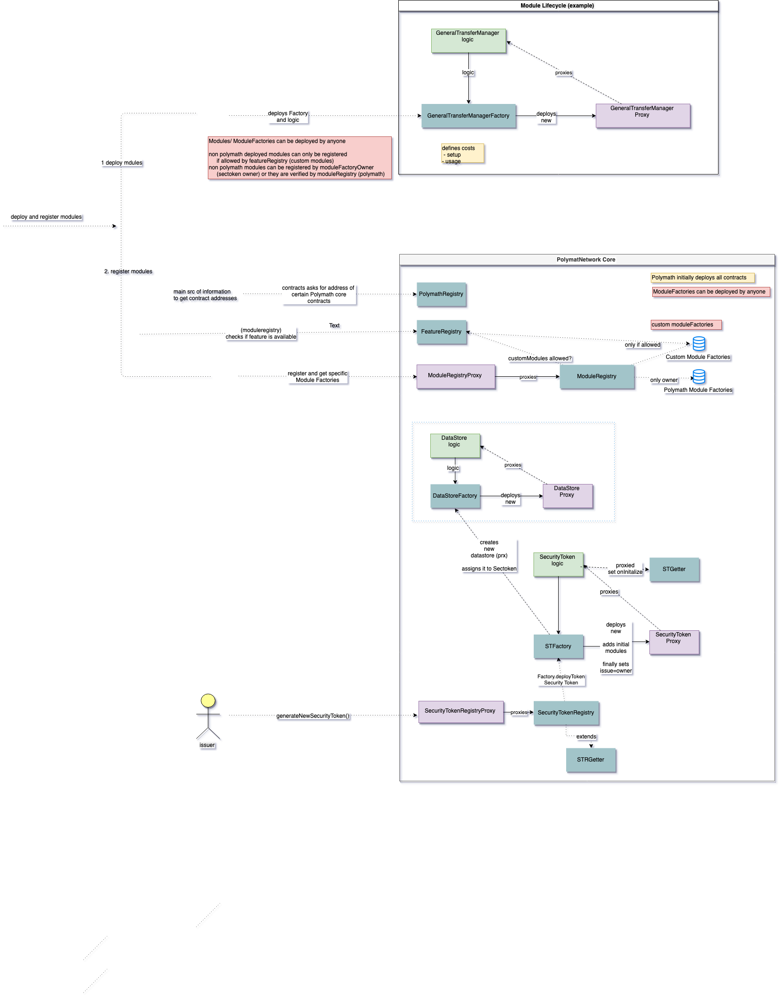

### 4.2 Security Stories

This section provides an excerpt of various security stories the team explored during the audit. Security stories aim to bring transparency about security relevant characteristics of the system, help to understand trust assumptions and describe potential high-level threats to the system. The goal is to spark security discussions, document them as part of a continuous process and even use them as input for internal SDL security practices. Relevant issues derived from the stories are listed in the Issue Details section. 

#### Polymath

* Polymath is in control of registries forming the backbone of the system, may modify the location of other system components (`PolymathRegistry`), enable and disable features (`FeatureRegistry`), register and verify modules that are available to security tokens (`ModuleRegistry`) and may front-run users by changing attributes/parts of the system.
* Polymath is in control of the security token generation, may disable token generation, delist and modify tokens reference in the registry.
* Polymath is in control of the security token registration, may disable ticker registration, modify/delete registered tickers.
* Polymath does not retain direct control of deployed security tokens once ownership was transferred to the issuer.
* Polymath remains indirect control of the security token via system components referenced in the security token (oracle, registries, ...) and may therefore indirectly interfere with the security token.
* **Polymath can delist a security token and immediately list a new one with the same ticker.** This might be a problem if done, for example, immediately before a hyped token sale if buyers are going to find the token via Polymath's registry rather than directly by address. The buyers could then end up buying the wrong token.
* Polymath is in control of Oracles and may freeze or manually override prices.
* Polymath is in control of the fee system and may arbitrarily change fees (front-run).

#### Issuer

* An issuer can register arbitrary and potentially insulting ticker symbols which may cause manual effort to be corrected.
* An issuer can create and add custom modules to security tokens that are unverified by Polymath if custom modules are generally allowed in the system, which may undermine trust assumptions.

#### Oracle

* An oracle can try to provide untruthful responses to manipulate prices in the system. Oracle responses are controlled by contracts owned by Polymath.

#### Other participants

* Other participants can observe ticker/token registrations.
* Other participants can observe and collect document information linked to security tokens.
* Other participants can attempt to register custom modules containing dangerous functionality and try to get them verified by Polymath to make them available for other participants if custom modules are allowed by the system.
* Other participants can attempt to spam the custom module registration to cause DoS scenarios (out of gas) for other participants if custom modules are allowed by the system.
* Other participants may be able to claim ownership of contracts that were left uninitialized by accident (e.g. `SecurityToken`, `SecurityTokenProxy`, ...)
* Other participants can attempt to perform ticker squatting, trying to register popular ticker names before others do, sell them or create manual effort due to filed disputes.
* Other participants can attempt to front-run ticker registrations which can result in a frustrating experience for potential issuers or result in manual effort due to filed disputes.
* Other participants may attempt to get control of system components by getting hold of other participants' private keys (extortion, social engineering, and traditional information security threats).

## 5 Tool-Based Analysis

Several tools were used to perform automated analysis of the reviewed contracts. These issues were reviewed by the audit team, and relevant issues are listed in the Issue Details section.

### 5.1 Mythril


Mythril is a security analysis tool for Ethereum smart contracts. It uses concolic analysis to detect various types of issues. The tool was used for automated vulnerability discovery for all audited contracts and libraries. More details on Mythril's current vulnerability coverage can be found [here](https://github.com/ConsenSys/mythril/wiki).

The raw output of the Mythril vulnerability scan can be found [here](./tool-output/mythril/mythril_report.md).

#### MythX

MythX is a security analysis API for Ethereum smart contracts. It performs multiple types of analysis, including fuzzing and symbolic execution, to detect many common vulnerability types. The tool was used for automated vulnerability discovery for all audited contracts and libraries. More details on MythX can be found at [mythx.io](https://mythx.io).

### 5.2 Harvey

Harvey is a greybox-fuzzer that uses light-weight program instrumentation to record the execution path for each tested input and compute its path identifier. The approach was developed by Valentin Wüstholz and Maria Christakis and published in their [2018 paper](https://arxiv.org/pdf/1807.07875.pdf).

### 5.3 Ethlint


[Ethlint](https://www.ethlint.com/) is an open source project for linting Solidity code. Only security-related issues were reviewed by the audit team.

The raw output of the Ethlint vulnerability scan can be found [here](./tool-output/ethlint/ethlint_report.md).
The raw output of the Solhint scan can be found [here](./tool-output/solhint/solhint_report.md).

### 5.4 Surya

Surya is a utility tool for smart contract systems. It provides a number of visual outputs and information about the structure of smart contracts. It also supports querying the function call graph in multiple ways to aid in the manual inspection and control flow analysis of contracts.

1. A complete list of functions with their visibility and modifiers can be found [here](./tool-output/surya/surya_report.md).
2. A visualization of the system's function call graph can be found [here (dot)](./tool-output/surya/callgraph.dot).
3. A visualization of the system's inheritance graph can be found [here](./tool-output/surya/inheritance.png) ([dot](./tool-output/surya/inheritance.dot)).

## 6 Test Coverage Measurement

Code coverage metrics indicate the amount of lines/statements/branches that are covered by the test-suite. It's important to note that "100% test coverage" is not a silver bullet. Our review also included an inspection of the test suite to ensure that testing included important edge cases. Be aware that code coverage does not provide information about the individual test-cases quality.

A fork of the [Solidity-Coverage](https://github.com/maxsam4/solidity-coverage) tool was used to measure the portion of the code base exercised by the test suite, and identify areas with little or no coverage. Specific sections of the code where necessary test coverage is missing are included in the Issue Details section.

The project is using the automated testing framework provided by Truffle. The test-suite is evaluating **1556** individual tests and the test-suite **passed** without errors. The corresponding console output can be found [here](./tool-output/truffle/truffle_test.md).

A code coverage report was generated and is provided along other tool output. The test coverage results can be viewed by opening the `index.html` file from the [coverage report](coverage-report) directory in a browser. Please find a summary of the coverage results below.


File                                                     |  % Stmts | % Branch |  % Funcs |  % Lines |Uncovered Lines |
---------------------------------------------------------|----------|----------|----------|----------|----------------|
 contracts/                                              |    96.74 |    88.98 |     93.2 |    97.14 |                |
 &nbsp;  FeatureRegistry.sol                             |      100 |       50 |      100 |      100 |                |
 &nbsp;  ModuleRegistry.sol                              |      100 |    90.79 |      100 |      100 |                |
 &nbsp;  Pausable.sol                                    |      100 |       75 |      100 |      100 |                |
 &nbsp;  PolymathRegistry.sol                            |      100 |      100 |      100 |      100 |                |
 &nbsp;  ReclaimTokens.sol                               |      100 |       75 |      100 |      100 |                |
 &nbsp;  STRGetter.sol                                   |    97.26 |    83.33 |    94.44 |    97.62 |         50,249 |
 &nbsp;  SecurityTokenRegistry.sol                       |    94.39 |    90.32 |    88.24 |    94.91 |... 846,847,848 |
 contracts/datastore/                                    |    97.89 |    73.68 |      100 |    98.04 |                |
 &nbsp;  DataStore.sol                                   |    97.78 |    76.47 |      100 |    97.95 |    303,315,339 |
 &nbsp;  DataStoreFactory.sol                            |      100 |       50 |      100 |      100 |                |
 &nbsp;  DataStoreProxy.sol                              |      100 |       50 |      100 |      100 |                |
 &nbsp;  DataStoreStorage.sol                            |      100 |      100 |      100 |      100 |                |
 contracts/interfaces/                                   |      100 |      100 |      100 |      100 |                |
 &nbsp;  IBoot.sol                                       |      100 |      100 |      100 |      100 |                |
 &nbsp;  ICheckPermission.sol                            |      100 |      100 |      100 |      100 |                |
 &nbsp;  IDataStore.sol                                  |      100 |      100 |      100 |      100 |                |
 &nbsp;  IFeatureRegistry.sol                            |      100 |      100 |      100 |      100 |                |
 &nbsp;  IModule.sol                                     |      100 |      100 |      100 |      100 |                |
 &nbsp;  IModuleFactory.sol                              |      100 |      100 |      100 |      100 |                |
 &nbsp;  IModuleRegistry.sol                             |      100 |      100 |      100 |      100 |                |
 &nbsp;  IOracle.sol                                     |      100 |      100 |      100 |      100 |                |
 &nbsp;  IOwnable.sol                                    |      100 |      100 |      100 |      100 |                |
 &nbsp;  IPoly.sol                                       |      100 |      100 |      100 |      100 |                |
 &nbsp;  IPolymathRegistry.sol                           |      100 |      100 |      100 |      100 |                |
 &nbsp;  ISTFactory.sol                                  |      100 |      100 |      100 |      100 |                |
 &nbsp;  ISTO.sol                                        |      100 |      100 |      100 |      100 |                |
 &nbsp;  ISecurityToken.sol                              |      100 |      100 |      100 |      100 |                |
 &nbsp;  ISecurityTokenRegistry.sol                      |      100 |      100 |      100 |      100 |                |
 &nbsp;  ITransferManager.sol                            |      100 |      100 |      100 |      100 |                |
 &nbsp;  IUSDTieredSTOProxy.sol                          |      100 |      100 |      100 |      100 |                |
 &nbsp;  IUpgradableTokenFactory.sol                     |      100 |      100 |      100 |      100 |                |
 &nbsp;  IVoting.sol                                     |      100 |      100 |      100 |      100 |                |
 contracts/interfaces/token/                             |      100 |      100 |      100 |      100 |                |
 &nbsp;  IERC1410.sol                                    |      100 |      100 |      100 |      100 |                |
 &nbsp;  IERC1594.sol                                    |      100 |      100 |      100 |      100 |                |
 &nbsp;  IERC1643.sol                                    |      100 |      100 |      100 |      100 |                |
 &nbsp;  IERC1644.sol                                    |      100 |      100 |      100 |      100 |                |
 contracts/libraries/                                    |    92.71 |    81.06 |    91.67 |    93.16 |                |
 &nbsp;  DecimalMath.sol                                 |      100 |      100 |      100 |      100 |                |
 &nbsp;  Encoder.sol                                     |    66.67 |      100 |    66.67 |    66.67 |          21,25 |
 &nbsp;  TokenLib.sol                                    |    88.46 |    80.95 |       90 |    88.73 |... 455,473,476 |
 &nbsp;  Util.sol                                        |      100 |      100 |      100 |      100 |                |
 &nbsp;  VersionUtils.sol                                |    96.77 |       65 |      100 |      100 |                |
 &nbsp;  VolumeRestrictionLib.sol                        |      100 |    91.67 |      100 |      100 |                |
 contracts/modules/                                      |    92.63 |    79.03 |    91.67 |    91.43 |                |
 &nbsp;  Module.sol                                      |    89.47 |    68.75 |    84.62 |    84.62 |    49,50,54,55 |
 &nbsp;  ModuleFactory.sol                               |    91.07 |    82.35 |    94.44 |    91.07 |... 160,199,200 |
 &nbsp;  UpgradableModuleFactory.sol                     |      100 |    83.33 |      100 |      100 |                |
 contracts/modules/Burn/                                 |      100 |      100 |      100 |      100 |                |
 &nbsp;  IBurn.sol                                       |      100 |      100 |      100 |      100 |                |
 contracts/modules/Checkpoint/                           |      100 |      100 |      100 |      100 |                |
 &nbsp;  ICheckpoint.sol                                 |      100 |      100 |      100 |      100 |                |
 contracts/modules/Checkpoint/Dividend/                  |    98.39 |    86.21 |    95.83 |    98.41 |                |
 &nbsp;  DividendCheckpoint.sol                          |    98.39 |    86.21 |    95.83 |    98.41 |        422,423 |
 contracts/modules/Checkpoint/Dividend/ERC20/            |      100 |    83.33 |      100 |      100 |                |
 &nbsp;  ERC20DividendCheckpoint.sol                     |      100 |       85 |      100 |      100 |                |
 &nbsp;  ERC20DividendCheckpointFactory.sol              |      100 |      100 |      100 |      100 |                |
 &nbsp;  ERC20DividendCheckpointProxy.sol                |      100 |       50 |      100 |      100 |                |
 &nbsp;  ERC20DividendCheckpointStorage.sol              |      100 |      100 |      100 |      100 |                |
 contracts/modules/Checkpoint/Dividend/Ether/            |      100 |    93.75 |      100 |      100 |                |
 &nbsp;  EtherDividendCheckpoint.sol                     |      100 |    96.67 |      100 |      100 |                |
 &nbsp;  EtherDividendCheckpointFactory.sol              |      100 |      100 |      100 |      100 |                |
 &nbsp;  EtherDividendCheckpointProxy.sol                |      100 |       50 |      100 |      100 |                |
 contracts/modules/Checkpoint/Voting/                    |      100 |      100 |      100 |      100 |                |
 &nbsp; VotingCheckpoint.sol                             |      100 |      100 |      100 |      100 |                |
 contracts/modules/Checkpoint/Voting/PLCR/               |    96.52 |     87.5 |      100 |    94.96 |                |
 &nbsp;  PLCRVotingCheckpoint.sol                        |    96.15 |    88.57 |      100 |    94.23 |... 296,297,298 |
 &nbsp;  PLCRVotingCheckpointFactory.sol                 |      100 |      100 |      100 |      100 |                |
 &nbsp;  PLCRVotingCheckpointProxy.sol                   |      100 |       50 |      100 |      100 |                |
 &nbsp;  PLCRVotingCheckpointStorage.sol                 |      100 |      100 |      100 |      100 |                |
 contracts/modules/Checkpoint/Voting/Transparent/        |     95.4 |    80.36 |      100 |    93.68 |                |
 &nbsp;  WeightedVoteCheckpoint.sol                      |    94.74 |    81.48 |      100 |     92.5 |... 224,225,226 |
 &nbsp;  WeightedVoteCheckpointFactory.sol               |      100 |      100 |      100 |      100 |                |
 &nbsp;  WeightedVoteCheckpointProxy.sol                 |      100 |       50 |      100 |      100 |                |
 &nbsp;  WeightedVoteCheckpointStorage.sol               |      100 |      100 |      100 |      100 |                |
 contracts/modules/PermissionManager/                    |      100 |    82.35 |      100 |      100 |                |
 &nbsp;  GeneralPermissionManager.sol                    |      100 |    84.38 |      100 |      100 |                |
 &nbsp;  GeneralPermissionManagerFactory.sol             |      100 |      100 |      100 |      100 |                |
 &nbsp;  GeneralPermissionManagerProxy.sol               |      100 |       50 |      100 |      100 |                |
 &nbsp;  GeneralPermissionManagerStorage.sol             |      100 |      100 |      100 |      100 |                |
 &nbsp;  IPermissionManager.sol                          |      100 |      100 |      100 |      100 |                |
 contracts/modules/STO/                                  |      100 |       50 |      100 |      100 |                |
 &nbsp;  STO.sol                                         |      100 |       50 |      100 |      100 |                |
 contracts/modules/STO/Capped/                           |      100 |       90 |      100 |      100 |                |
 &nbsp;  CappedSTO.sol                                   |      100 |    92.11 |      100 |      100 |                |
 &nbsp;  CappedSTOFactory.sol                            |      100 |      100 |      100 |      100 |                |
 &nbsp;  CappedSTOProxy.sol                              |      100 |       50 |      100 |      100 |                |
 &nbsp;  CappedSTOStorage.sol                            |      100 |      100 |      100 |      100 |                |
 contracts/modules/STO/PreSale/                          |      100 |    83.33 |      100 |      100 |                |
 &nbsp;  PreSaleSTO.sol                                  |      100 |     87.5 |      100 |      100 |                |
 &nbsp;  PreSaleSTOFactory.sol                           |      100 |      100 |      100 |      100 |                |
 &nbsp;  PreSaleSTOProxy.sol                             |      100 |       50 |      100 |      100 |                |
 &nbsp;  PreSaleSTOStorage.sol                           |      100 |      100 |      100 |      100 |                |
 contracts/modules/STO/USDTiered/                        |    98.68 |    76.53 |      100 |    98.79 |                |
 &nbsp;  USDTieredSTO.sol                                |    98.62 |    77.08 |      100 |    98.71 |    556,597,642 |
 &nbsp;  USDTieredSTOFactory.sol                         |      100 |      100 |      100 |      100 |                |
 &nbsp;  USDTieredSTOProxy.sol                           |      100 |       50 |      100 |      100 |                |
 &nbsp;  USDTieredSTOStorage.sol                         |      100 |      100 |      100 |      100 |                |
 contracts/modules/TransferManager/                      |     37.5 |      100 |       60 |    54.55 |                |
 &nbsp;  TransferManager.sol                             |     37.5 |      100 |       60 |    54.55 | 35,42,43,44,45 |
 contracts/modules/TransferManager/BTM/                  |    99.13 |    96.88 |    97.14 |    99.21 |                |
 &nbsp;  BlacklistTransferManager.sol                    |    99.05 |    98.39 |    96.88 |    99.12 |            433 |
 &nbsp;  BlacklistTransferManagerFactory.sol             |      100 |      100 |      100 |      100 |                |
 &nbsp;  BlacklistTransferManagerProxy.sol               |      100 |       50 |      100 |      100 |                |
 &nbsp;  BlacklistTransferManagerStorage.sol             |      100 |      100 |      100 |      100 |                |
 contracts/modules/TransferManager/CTM/                  |     96.3 |     87.5 |    90.91 |    96.67 |                |
 &nbsp;  CountTransferManager.sol                        |    94.12 |      100 |     87.5 |    94.12 |             56 |
 &nbsp;  CountTransferManagerFactory.sol                 |      100 |      100 |      100 |      100 |                |
 &nbsp;  CountTransferManagerProxy.sol                   |      100 |       50 |      100 |      100 |                |
 &nbsp;  CountTransferManagerStorage.sol                 |      100 |      100 |      100 |      100 |                |
 contracts/modules/TransferManager/GTM/                  |    99.32 |     87.1 |      100 |    99.41 |                |
 &nbsp;  GeneralTransferManager.sol                      |    99.25 |    88.33 |      100 |    99.35 |            363 |
 &nbsp;  GeneralTransferManagerFactory.sol               |      100 |      100 |      100 |      100 |                |
 &nbsp;  GeneralTransferManagerProxy.sol                 |      100 |       50 |      100 |      100 |                |
 &nbsp;  GeneralTransferManagerStorage.sol               |      100 |      100 |      100 |      100 |                |
 contracts/modules/TransferManager/LTM/                  |    88.73 |    72.41 |    83.33 |    89.54 |                |
 &nbsp;  LockUpTransferManager.sol                       |    87.88 |    73.21 |    82.05 |    88.57 |... 516,626,690 |
 &nbsp;  LockUpTransferManagerFactory.sol                |      100 |      100 |      100 |      100 |                |
 &nbsp;  LockUpTransferManagerProxy.sol                  |      100 |       50 |      100 |      100 |                |
 &nbsp;  LockUpTransferManagerStorage.sol                |      100 |      100 |      100 |      100 |                |
 contracts/modules/TransferManager/MATM/                 |    94.69 |       82 |    95.65 |     95.2 |                |
 &nbsp;  ManualApprovalTransferManager.sol               |    94.17 |    83.33 |       95 |    94.64 |... 268,269,390 |
 &nbsp;  ManualApprovalTransferManagerFactory.sol        |      100 |      100 |      100 |      100 |                |
 &nbsp;  ManualApprovalTransferManagerProxy.sol          |      100 |       50 |      100 |      100 |                |
 &nbsp;  ManualApprovalTransferManagerStorage.sol        |      100 |      100 |      100 |      100 |                |
 contracts/modules/TransferManager/PTM/                  |    97.44 |    92.86 |    92.86 |    97.62 |                |
 &nbsp;  PercentageTransferManager.sol                   |    96.55 |      100 |    90.91 |    96.55 |             69 |
 &nbsp;  PercentageTransferManagerFactory.sol            |      100 |      100 |      100 |      100 |                |
 &nbsp;  PercentageTransferManagerProxy.sol              |      100 |       50 |      100 |      100 |                |
 &nbsp;  PercentageTransferManagerStorage.sol            |      100 |      100 |      100 |      100 |                |
 contracts/modules/TransferManager/VRTM/                 |    89.66 |    87.93 |    87.27 |    90.32 |                |
 &nbsp;  VolumeRestrictionTM.sol                         |    89.19 |     88.6 |    86.54 |     89.7 |... 9,1256,1257 |
 &nbsp;  VolumeRestrictionTMFactory.sol                  |      100 |      100 |      100 |      100 |                |
 &nbsp;  VolumeRestrictionTMProxy.sol                    |      100 |       50 |      100 |      100 |                |
 &nbsp;  VolumeRestrictionTMStorage.sol                  |      100 |      100 |      100 |      100 |                |
 contracts/modules/Wallet/                               |    98.19 |    84.88 |      100 |    98.37 |                |
 &nbsp;  VestingEscrowWallet.sol                         |    98.08 |    85.71 |      100 |    98.24 |    120,121,122 |
 &nbsp;  VestingEscrowWalletFactory.sol                  |      100 |      100 |      100 |      100 |                |
 &nbsp;  VestingEscrowWalletProxy.sol                    |      100 |       50 |      100 |      100 |                |
 &nbsp;  VestingEscrowWalletStorage.sol                  |      100 |      100 |      100 |      100 |                |
 &nbsp;  Wallet.sol                                      |      100 |      100 |      100 |      100 |                |
 contracts/proxy/                                        |    79.49 |    72.73 |    79.17 |    79.07 |                |
 &nbsp;  ModuleRegistryProxy.sol                         |      100 |      100 |      100 |      100 |                |
 &nbsp;  OwnedProxy.sol                                  |    33.33 |    16.67 |     37.5 |    30.77 |... 77,85,86,87 |
 &nbsp;  OwnedUpgradeabilityProxy.sol                    |      100 |     87.5 |      100 |      100 |                |
 &nbsp;  Proxy.sol                                       |      100 |      100 |      100 |      100 |                |
 &nbsp;  SecurityTokenRegistryProxy.sol                  |      100 |      100 |      100 |      100 |                |
 &nbsp;  UpgradeabilityProxy.sol                         |      100 |      100 |      100 |      100 |                |
 contracts/tokens/                                       |    90.58 |    70.77 |    93.86 |     90.2 |                |
 &nbsp;  OZStorage.sol                                   |       50 |      100 |       50 |       50 |             15 |
 &nbsp;  STFactory.sol                                   |    91.67 |       50 |    71.43 |    92.31 |184,185,195,196 |
 &nbsp;  STGetter.sol                                    |    74.29 |       80 |    90.48 |    74.07 |... 284,285,287 |
 &nbsp;  SecurityToken.sol                               |    95.28 |    76.25 |    97.59 |     94.9 |... 936,937,945 |
 &nbsp;  SecurityTokenProxy.sol                          |      100 |       50 |      100 |      100 |                |
 &nbsp;  SecurityTokenStorage.sol                        |      100 |      100 |      100 |      100 |                |
**All files**                                            |**95.12** |**83.35** |**94.62** |**95.18** |                |


### 6.1 Test Coverage observations

- **95.12%** of Statements, **83.35%** of Branches, **94.62%** of Functions and **95.18%** Lines are covered by test-cases
  - It is important to provide an extensive test-suite that covers all statements, functions and paths of the contract system. Any contract system that is used on the main net should have as a minimum requirement a 100% test coverage especially. Please note that a seemingly high coverage rate of 95% means that 5% of Statements are uncovered. A few percent can easily translate to a couple of hundred uncovered statements for large codebases.
- The Branch coverage of 83.35% (257 uncovered branches) is low.
- Negative testing of `require()` assertions or edge-cases is often missing contributing to the low branch coverage. It is suggested to add positive and negative tests especially for important language constructs like `require` that often perform input validation.
- Some functions are completely uncovered or exempt from testing (see below). 

#### No coverage stats available
The following contracts are not part of the coverage statistics collection:

* **contracts/storage** - contains storage layouts for other modules but also some logic (initialization) that should be tested
* **contracts/oracles** - contains oracle interface contracts written and maintained by polymath that should be tested.
* **contracts/modules/experimental** - new experimental modules that should be tested.
* **contracts/external** - contains externally provided OraclizeI/IMedianizer contracts that should be mocked for testing.
* **contracts/helpers/polytoken** - is the ERC20 POLY token that should be tested but is out of scope for this audit.
* **contracts/libraries/KindMath, BokkyPooBahsDateTimeLibrary** - are 3rd party libraries with unclear test/coverage status.

#### Contract Methods lacking coverage

-  **STRGetter**
   - *uncovered*: `getExpiryLimit()`
   - *partially*: `_ownerInTicker()`
- **SecurityTokenRegistry**
  - *uncovered*: `updateFromRegistry(), getSecurityTokenLaunchFee(), getTickerRegistrationFee(), setGetterRegistry(), removeProtocolFactory()`
  - *partially*: `generateNewSecurityToken(), transferTickerOwnership()`
- **Encoder**
  - *uncovered*: `getKey()`
- **TokenLib**
  - *uncovered*: `hash(), extractSigner()`   
- **Module**
  - *uncovered*: `modifier(onlyFactoryOwner,onlyFactoryOrOwner)`
- **ModuleFactory*
  - *uncovered*: `changeTags()`  
  - *partially*: `changeSTVersionBounds(), usageCostInPoly()` 
- **DividendCheckpoint**
  - *uncovered*: `isClaimed()`
- **TransferManager**
  - *uncovered*: `getTokensByPartition(), getPartitions()`
- **BlacklistTransferManager**
  - *uncovered*: `getAllBlacklists()`
- **CountTransferManager**
  - *uncovered*:`verifyTransfer()`
- **GeneralTransferManager**
  - *partially*: `_modifyInvestorFlag()`
- **LockupTransferManager**
  - *uncovered*:`verifyTransfer(), addLockUpByNameMulti(), removeLockUpFromUser(), removeLockupTypeMulti(), modifyLockUpTypeMulti(), getListOfAddresses(), getLockupsNamesToUser()`
  - *partially*: `_modifyLockUpType(), _addNewLockUpType(), getTokensByPartition()` 
- **ManualApprovalTransferManager**
  - *uncovered*: `modifyManualApprovalMulti()`
  - *partially*: `_modifyManualApproval()`  
- **PercentageTransferManager**
  - *uncovered*:`verifyTransfer()`
- **VolumeRestrictionTM**
  - *uncovered*:`addIndividualDailyRestrictionMulti(), removeIndividualDailyRestrictionMulti(),removeDefaultDailyRestriction(), modifyIndividualDailyRestrictionMulti(), modifyDefaultRestriction(), modifyDefaultDailyRestriction(), getPermissions()`
  - *partially*: `verifyTransfer(), addIndividualDailyRestriction()`
- **VestingEscrowWallet**
  - *uncovered*:`getTreasuryWallet()`
- **OwnedProxy**
  - *uncovered*: `modifier(ifOwner), proxyOwner(), implementation(), transferProxyOwnership()`
- **OZStorage**
  - *uncovered*: `totalSupply()`
- **STFactory**
  - *uncovered*: `updateDefaultTransferManager(), updateDefaultDataStore()`
- **STGetter**
  - *uncovered*: `partitionsOf(), _appendPartition()`
- **SecurityToken**
  - *uncovered*: `modifier(onlyTokenFactory), canTransferFrom(), disableController(), freezeIssuance()`
  - *partially*: `_canTransfer(), _executeTransfer()` 

## 7 Business Logic Review v2.2.0 to v3.0.0 Modules

As part of this audit we have further reviewed the business logic in version 2.2.0 of the `LockUpTransferManager`, `BlacklistTransferManager` and `VestingEscrowWallet` to ensure it matches the version 3.0.0 implementations. Polymath created the diffs and provided them to the audit team. They can be found [here](./module_diffs_v2.2.0-v3.0.0/). Whilst we have audited that the business logic is functionally equivalent the correctness of these modules relies on the surrounding 2.2.0 code which has not been audited as part of this review. The following changes have been noted:

* Many changes are related to solidity 0.4.x vs. 0.5.x.
* Minor changes to delegator permissions `OPERATOR` and `ADMIN`.
* Insignificant visibility differences (`public` vs. `external`).
* Small internal functions have been removed and their logic is inlined instead.

## Appendix 1  - File Hashes

The SHA1 hash of the source code files in scope of the audit are listed in the table below.

| File Name                                                                         | SHA-1 Hash                               |
| --------------------------------------------------------------------------------- | ---------------------------------------- |
| contracts/FeatureRegistry.sol                                                     | 6eb07dfc15c6eac6d72fa1e856f86fb2e6e4e553 |
| contracts/Migrations.sol                                                          | 3d3d5e4f8d8654dc16efd17ac3494cde3b124fc5 |
| contracts/ModuleRegistry.sol                                                      | 72a5c25db93193603880a82118c0d17c989fe517 |
| contracts/Pausable.sol                                                            | 89b3e08a3b4a12e935cf08fb713707d08ac95d92 |
| contracts/PolymathRegistry.sol                                                    | 3f079b9e9e9bb567c04ccc033ef91c1039b76e07 |
| contracts/ReclaimTokens.sol                                                       | 85620841940605c1f94ee4cd74208b3675463eb1 |
| contracts/STRGetter.sol                                                           | 2dd20ebf94c70d164fe24c32dc67e0609deb8820 |
| contracts/SecurityTokenRegistry.sol                                               | 3b5ffaddfe371954c458f8dc6b01507bc9af543d |
| contracts/datastore/DataStore.sol                                                 | 6978f43dbf995aaf453911462a29afe4a146abe8 |
| contracts/datastore/DataStoreFactory.sol                                          | c0a9308234c73d9628702975bc1bb231e93fd1a4 |
| contracts/datastore/DataStoreProxy.sol                                            | db14fc8c4363bfdb6d8214bf6fe7c0b5a0e11121 |
| contracts/datastore/DataStoreStorage.sol                                          | f0985b4af4fdcd63a9505fca80199b0b6068a6d4 |
| contracts/external/IMedianizer.sol                                                | cafcc374ec685f2291a843c98f51401f740e52c2 |
| contracts/external/oraclizeAPI.sol                                                | c84fcbf4829b972bac7358f496a7fce600a6cf14 |
| contracts/helpers/PolyToken.sol                                                   | 390dc1245ec6ab0358f7421c9562e0fb4eedcd97 |
| contracts/interfaces/IBoot.sol                                                    | 48dd670fe3461955dfed6ab62638c61d97573c41 |
| contracts/interfaces/ICheckPermission.sol                                         | e2a69c51af575bed0a27460a44530dcc26e6bc17 |
| contracts/interfaces/IDataStore.sol                                               | c88cd1e8070af809b75fe096022c362a524b745a |
| contracts/interfaces/IFeatureRegistry.sol                                         | a4c9e5c062370a777688a5f9de22e03a8c5f8873 |
| contracts/interfaces/IModule.sol                                                  | bb7f108b785f62f22b8be7ae44139403ea8769c9 |
| contracts/interfaces/IModuleFactory.sol                                           | 80eb80e18f6bf5a1e30e55d56221ca2b3a1fafc8 |
| contracts/interfaces/IModuleRegistry.sol                                          | 8240a2a1e7a61431768746c61c30d5280d51ecad |
| contracts/interfaces/IOracle.sol                                                  | 3b56748248e4b2ae01116010e8ae168381c3918a |
| contracts/interfaces/IOwnable.sol                                                 | 5bd12c84bbb534c7d8bbcebe1c3ac03df6e5b4a4 |
| contracts/interfaces/IPoly.sol                                                    | a2fd2f6aabe3d52c6dc033e5ec713d1b521ccb9b |
| contracts/interfaces/IPolymathRegistry.sol                                        | cf9527df106a932ab54ff219c25cb5f1d7039970 |
| contracts/interfaces/ISTFactory.sol                                               | 8f3e5148ee98ed8411343f99f5e2530cb918b72c |
| contracts/interfaces/ISTO.sol                                                     | a81a894300a4c5f7d1a21f793bee274c5ce636d0 |
| contracts/interfaces/ISecurityToken.sol                                           | 0fcacc9cecf11b7a5da16f24dbb9b7189e9426f5 |
| contracts/interfaces/ISecurityTokenRegistry.sol                                   | 2ce5029ef544a5462fc3498be131aa13fd767677 |
| contracts/interfaces/ITransferManager.sol                                         | 729dae77edc34f5982cb072406ecbaf6c0029d68 |
| contracts/interfaces/IUSDTieredSTOProxy.sol                                       | 8c96ef686be2dbec63d36c6a06ac2d2ac7c2f5d8 |
| contracts/interfaces/IUpgradableTokenFactory.sol                                  | 252626e0129fd999f55c0314fe53a7c0fb613511 |
| contracts/interfaces/IVoting.sol                                                  | 82616bd359a8e491cc1270c50c96deda78a3e9f2 |
| contracts/interfaces/token/IERC1410.sol                                           | 108f2850523289c17c4c77e7fd4c72ec3fc47358 |
| contracts/interfaces/token/IERC1594.sol                                           | 00b44268bd3bdfffe4cd47d2d2e40e10dacd6338 |
| contracts/interfaces/token/IERC1643.sol                                           | 9293365b6ead5f78726f3ded0cf7d9b1ae05e04e |
| contracts/interfaces/token/IERC1644.sol                                           | 55a26529da680652c7f6a3ea9a2a3de190a1216f |
| contracts/libraries/BokkyPooBahsDateTimeLibrary.sol                               | b00a2888d7b718dd4ac6dc8a009ac0960d982464 |
| contracts/libraries/DecimalMath.sol                                               | e561ef0dc7cc0ee16aa7949bf7e54d3496c116ec |
| contracts/libraries/Encoder.sol                                                   | 6113594a29088d5cd7a4aa61885901f48ed75556 |
| contracts/libraries/KindMath.sol                                                  | 49e5106f23fa40a07ce7db54cd740be7437eec70 |
| contracts/libraries/TokenLib.sol                                                  | c66f623f4875644d77dac541fe7cce8160bea2d0 |
| contracts/libraries/Util.sol                                                      | 6bda132058a98c7d88d0349a2283484959ee5357 |
| contracts/libraries/VersionUtils.sol                                              | 7de9cfc1ec7c10ebb628ad043e42f1a8e66d1919 |
| contracts/libraries/VolumeRestrictionLib.sol                                      | b5f38144c0da1c28acf706f073e4ef8f330be87b |
| contracts/mocks/Dummy/DummySTO.sol                                                | 35fea506d1a5e9bdbf1e25f7c993d689b0998dd6 |
| contracts/mocks/Dummy/DummySTOFactory.sol                                         | b3e4d6c8af1a9048209f1b85978286b81a454aeb |
| contracts/mocks/Dummy/DummySTOProxy.sol                                           | ca60135c227b940847793fb08aac24e4eb0d889a |
| contracts/mocks/Dummy/DummySTOStorage.sol                                         | 9d76e213811253ca67d04ef07519d6bd83b25766 |
| contracts/mocks/FunctionSigClash1.sol                                             | d8482c3241ed2be9638938052c3cbe6775df2fcc |
| contracts/mocks/FunctionSigClash2.sol                                             | bfd89a2981b578a820bfb8b7bf25c7c5f47afaee |
| contracts/mocks/MockBurnFactory.sol                                               | dc3155ac6d0167863b05153949ae0f00b735e677 |
| contracts/mocks/MockCountTransferManager.sol                                      | 2207fcecf1c3098472555831de3b2fa0ce9a4f15 |
| contracts/mocks/MockFactory.sol                                                   | 8019db0c439d4b6d40590fe0d0e414183b7ed1b5 |
| contracts/mocks/MockModuleRegistry.sol                                            | 6efefc04d0f8569a00c28e37a81c7eec04ddab35 |
| contracts/mocks/MockOracle.sol                                                    | 83f97501c8f78d7e336345f71bba76b7351ddb20 |
| contracts/mocks/MockPolyOracle.sol                                                | 3a0295c547d658a92d3699607290014834ba55cb |
| contracts/mocks/MockRedemptionManager.sol                                         | ac5fa55ed85358d0dcde7bed03b7f9ae21186b89 |
| contracts/mocks/MockSTGetter.sol                                                  | 8470f52b08cd8a5c9f8e79db7e6085116d4cdcaf |
| contracts/mocks/MockSecurityTokenLogic.sol                                        | 95fc212040cdfc54b6db3b4dee76af9105ba560d |
| contracts/mocks/MockWrongTypeFactory.sol                                          | f5d7e701f2a49567c4511feca9d01b678ab2df20 |
| contracts/mocks/PolyTokenFaucet.sol                                               | cba48fda96073d5c67c75bd2319ae06c699c8b28 |
| contracts/mocks/SecurityTokenMock.sol                                             | 62438ca46d5a75f23c6dd91ae507bcf85f5d34c9 |
| contracts/mocks/SecurityTokenRegistryMock.sol                                     | d44ed787558d454522cf00f3abc33c8000ec6cec |
| contracts/mocks/TestSTOFactory.sol                                                | 64705949cd53b2cdf6b051bf83810a7399622bbe |
| contracts/modules/Burn/IBurn.sol                                                  | 1d8febfe2a4d66cc17786574e35423ad97aa5806 |
| contracts/modules/Checkpoint/Dividend/DividendCheckpoint.sol                      | e3ebe55d16afc76b2ec1c123fc63d6187b1fb619 |
| contracts/modules/Checkpoint/Dividend/ERC20/ERC20DividendCheckpoint.sol           | 7aca4a6c96d73eff535fca2e45378f92bbf7eb98 |
| contracts/modules/Checkpoint/Dividend/ERC20/ERC20DividendCheckpointFactory.sol    | ca89f5c7d800a9459830b6ddcd119ee7809c2924 |
| contracts/modules/Checkpoint/Dividend/ERC20/ERC20DividendCheckpointProxy.sol      | c640fa7c7a22affb8e278ca87dfd7ad878a428bd |
| contracts/modules/Checkpoint/Dividend/ERC20/ERC20DividendCheckpointStorage.sol    | 2111bf5bc55630858b9057b2be772d084f41f9c9 |
| contracts/modules/Checkpoint/Dividend/Ether/EtherDividendCheckpoint.sol           | d78a164391e60610e88601644e7b659695282742 |
| contracts/modules/Checkpoint/Dividend/Ether/EtherDividendCheckpointFactory.sol    | 6130cbd004bb766625cef9ae6c8917982848a049 |
| contracts/modules/Checkpoint/Dividend/Ether/EtherDividendCheckpointProxy.sol      | 758c989eafb1d49e4024862402e2d6974bc646b6 |
| contracts/modules/Checkpoint/ICheckpoint.sol                                      | 69d9d19318f3fa26a17494ec2a6643c96d382e9d |
| contracts/modules/Checkpoint/Voting/PLCR/PLCRVotingCheckpoint.sol                 | b7fe1a9790fba150a3a5d877b5ce764aec911ea8 |
| contracts/modules/Checkpoint/Voting/PLCR/PLCRVotingCheckpointFactory.sol          | ff8ed7af494dacdd1523b71830b6aad5ac48ebd7 |
| contracts/modules/Checkpoint/Voting/PLCR/PLCRVotingCheckpointProxy.sol            | f8d68c2e1badec3d511c7085fb3ad00ee83713fa |
| contracts/modules/Checkpoint/Voting/PLCR/PLCRVotingCheckpointStorage.sol          | 6ef8b528f6a458ad9452d329c8cb1a04226f4135 |
| contracts/modules/Checkpoint/Voting/Transparent/WeightedVoteCheckpoint.sol        | 7a7ee3a77522d8a9e87e0d50c247bcb63933d85c |
| contracts/modules/Checkpoint/Voting/Transparent/WeightedVoteCheckpointFactory.sol | 74dfa812b239d7621b9b049578e706a74673a9b9 |
| contracts/modules/Checkpoint/Voting/Transparent/WeightedVoteCheckpointProxy.sol   | 8431f3becdd1dd27c5ffb9d821a74c02b7fcadc8 |
| contracts/modules/Checkpoint/Voting/Transparent/WeightedVoteCheckpointStorage.sol | 426b71a2d392e9b8c4ee7eab9ec8c42dc1e69989 |
| contracts/modules/Checkpoint/Voting/VotingCheckpoint.sol                          | 1e61a190b43431f5a687b82ce105a58662ff7b32 |
| contracts/modules/Experimental/Burn/TrackedRedemption.sol                         | e707351a092080708829b0584b86012827e1d5a0 |
| contracts/modules/Experimental/Burn/TrackedRedemptionFactory.sol                  | c7f4ee146064f3083d2a4703332dbfee40770b06 |
| contracts/modules/Experimental/Mixed/ScheduledCheckpoint.sol                      | 95907eb423e89e71b75d5f5437c7abc6c1585f9b |
| contracts/modules/Experimental/Mixed/ScheduledCheckpointFactory.sol               | f3f3445e25f36f93fd16dfac7ddb2f13b998692f |
| contracts/modules/Experimental/TransferManager/KYCTransferManager.sol             | b6925b29f9869765a466cccbb1dd08701272b2ba |
| contracts/modules/Experimental/TransferManager/KYCTransferManagerFactory.sol      | a338ceaba5e96074631bfcb58c072637de65266a |
| contracts/modules/Experimental/TransferManager/SignedTransferManager.sol          | a5eca562c086e70bd1cb64cea513c202adeab431 |
| contracts/modules/Experimental/TransferManager/SignedTransferManagerFactory.sol   | 19b7a56f99abbd132ffed43cf410f760f3b2d15e |
| contracts/modules/Module.sol                                                      | bcc1d122caec436df7ef92fe4af3cf7aec46e921 |
| contracts/modules/ModuleFactory.sol                                               | ba78f80a7fc74c7dd603b4eb4f6d8823c1b9b440 |
| contracts/modules/PermissionManager/GeneralPermissionManager.sol                  | 085c892ea3b41aabd9c0fdb271566f55a81387ac |
| contracts/modules/PermissionManager/GeneralPermissionManagerFactory.sol           | d70f682b982831e44101f076be2974580fd766b0 |
| contracts/modules/PermissionManager/GeneralPermissionManagerProxy.sol             | 6950049d869c1b0d39d538ceb7fdda52bb7169b4 |
| contracts/modules/PermissionManager/GeneralPermissionManagerStorage.sol           | 8f1f92a00c6a852e01b22d2b550ea7e2347cc299 |
| contracts/modules/PermissionManager/IPermissionManager.sol                        | 92fb2bfc0cede22bd169a106f929c208ec257de8 |
| contracts/modules/STO/Capped/CappedSTO.sol                                        | 951e2f6ce5fd7a28181710c70a1c0be7c81c4037 |
| contracts/modules/STO/Capped/CappedSTOFactory.sol                                 | 7315b6935b638879bd58ec7f0c63a5a9d400a87d |
| contracts/modules/STO/Capped/CappedSTOProxy.sol                                   | 48d65c94491c9286e5593774d65cfbe70c86d2c1 |
| contracts/modules/STO/Capped/CappedSTOStorage.sol                                 | 523b09b120f182be954a01772ed9bdf1f6a556c3 |
| contracts/modules/STO/PreSale/PreSaleSTO.sol                                      | 4126f80eb142067a18fe3bcfde69f6aac213d0c4 |
| contracts/modules/STO/PreSale/PreSaleSTOFactory.sol                               | 49576e9283f76e7a8e9369719dc55125f551923f |
| contracts/modules/STO/PreSale/PreSaleSTOProxy.sol                                 | 831ad28018290f7b48d1e9e04b4d4010761f51a4 |
| contracts/modules/STO/PreSale/PreSaleSTOStorage.sol                               | 90e8c10f34cfafeb9cf9b90107738997fdb90de3 |
| contracts/modules/STO/STO.sol                                                     | 9a13d33e03cc104fbdb55d5ee33e729e4e370c19 |
| contracts/modules/STO/USDTiered/USDTieredSTO.sol                                  | a99588f6d24a3c999ac2bd754551dcb781d51424 |
| contracts/modules/STO/USDTiered/USDTieredSTOFactory.sol                           | 56f004a8715865a6e3dfbb955decee859f1db93c |
| contracts/modules/STO/USDTiered/USDTieredSTOProxy.sol                             | b68a07d19104951cba83bd3a6fe1f68bbda183a7 |
| contracts/modules/STO/USDTiered/USDTieredSTOStorage.sol                           | 918daba3046958f5ad4ec76a415accf2e3067d5b |
| contracts/modules/TransferManager/BTM/BlacklistTransferManager.sol                | 2874309dae84a81600bc2b3122a6701529c7097a |
| contracts/modules/TransferManager/BTM/BlacklistTransferManagerFactory.sol         | 3883bd95bbc65d9682c003f8b1c9daf6600cddb7 |
| contracts/modules/TransferManager/BTM/BlacklistTransferManagerProxy.sol           | 700ffadb11d5226da482e799b04643c81a09d5e0 |
| contracts/modules/TransferManager/BTM/BlacklistTransferManagerStorage.sol         | dc656d574f2558798359ed89c48a8cec498426e7 |
| contracts/modules/TransferManager/CTM/CountTransferManager.sol                    | 903d30b552a13ea8d75eb1da85dd9987576e3bdf |
| contracts/modules/TransferManager/CTM/CountTransferManagerFactory.sol             | 537c3937f749d68fa3a172b9c474ff7f0ec6469d |
| contracts/modules/TransferManager/CTM/CountTransferManagerProxy.sol               | be435b2d7af86b78a1076fbac6aa58a07f50bfc4 |
| contracts/modules/TransferManager/CTM/CountTransferManagerStorage.sol             | 7c2fa10ba41d9d3e83d1169b0029c1304665b19f |
| contracts/modules/TransferManager/GTM/GeneralTransferManager.sol                  | 9ce27054c2d24b30de0aca9f3963fb2ba19d85c9 |
| contracts/modules/TransferManager/GTM/GeneralTransferManagerFactory.sol           | a3addfa4782590d666a617cd94c6cb0c09d8dde8 |
| contracts/modules/TransferManager/GTM/GeneralTransferManagerProxy.sol             | 9d2b0a304ef08e7a7ddcebb3e8df63bf0ab6c7f8 |
| contracts/modules/TransferManager/GTM/GeneralTransferManagerStorage.sol           | 49c81ce1bf2cf702b13aad22ea0dd54cf41e04a3 |
| contracts/modules/TransferManager/LTM/LockUpTransferManager.sol                   | aa3f0734f9ac362e0498cc6d136b35530d7e81b8 |
| contracts/modules/TransferManager/LTM/LockUpTransferManagerFactory.sol            | f5013c9283b2490388d5ae3daa16b8e8a1011400 |
| contracts/modules/TransferManager/LTM/LockUpTransferManagerProxy.sol              | f9004d720b98ff8f7073269f344e86533c660c86 |
| contracts/modules/TransferManager/LTM/LockUpTransferManagerStorage.sol            | e74eb033eaa8f82612143a11b469d7154664aeac |
| contracts/modules/TransferManager/MATM/ManualApprovalTransferManager.sol          | 179b3eac8ac1ddeb84e41b2bbc2bf50ad7a66f99 |
| contracts/modules/TransferManager/MATM/ManualApprovalTransferManagerFactory.sol   | 5a10f30dc054d32fea568c40fe2838a66b47c234 |
| contracts/modules/TransferManager/MATM/ManualApprovalTransferManagerProxy.sol     | 5a002ac39b2f058a49db3444f829b0e6070b260f |
| contracts/modules/TransferManager/MATM/ManualApprovalTransferManagerStorage.sol   | 001d1060967ad06cf897f91c3587bfae7d4ccbf6 |
| contracts/modules/TransferManager/PTM/PercentageTransferManager.sol               | 2204753c49ce966be9f903d90f96cebf7b438091 |
| contracts/modules/TransferManager/PTM/PercentageTransferManagerFactory.sol        | b24afc7d6dc628ff9167781676b96d28187f464d |
| contracts/modules/TransferManager/PTM/PercentageTransferManagerProxy.sol          | c42604ffd2881359da150ea5a95d4e3fe3b68a5c |
| contracts/modules/TransferManager/PTM/PercentageTransferManagerStorage.sol        | 63d1fcd7cdf8e6ae98f053aee743cfc6c716f6d1 |
| contracts/modules/TransferManager/TransferManager.sol                             | 7b23f67473f0f4ee9b0175bf246fad97dc9e78d1 |
| contracts/modules/TransferManager/VRTM/VolumeRestrictionTM.sol                    | 2067e26d91a282db22ddd86543caaaf38778a609 |
| contracts/modules/TransferManager/VRTM/VolumeRestrictionTMFactory.sol             | 95ced5ad2bebd8a6a2d0e57ebcf0c200bc709667 |
| contracts/modules/TransferManager/VRTM/VolumeRestrictionTMProxy.sol               | 659b70802cd0001a7e0f5812a246213d9cc0c92c |
| contracts/modules/TransferManager/VRTM/VolumeRestrictionTMStorage.sol             | 7997f22900bba5b8e276f17510ac62462a7f422b |
| contracts/modules/UpgradableModuleFactory.sol                                     | d3d2042947c978cf2fe0ad40883103fc917af01e |
| contracts/modules/Wallet/VestingEscrowWallet.sol                                  | d52dee12c5ae0e8437927c12d546d939db50adf9 |
| contracts/modules/Wallet/VestingEscrowWalletFactory.sol                           | 82778bd395c1fdb9fb795eb3b18494d2536124d4 |
| contracts/modules/Wallet/VestingEscrowWalletProxy.sol                             | 6ab5ca89b14dd7746579d3f3f9bedba540287398 |
| contracts/modules/Wallet/VestingEscrowWalletStorage.sol                           | 40f2c07402fca9f3ba3ebf215f74d81755694440 |
| contracts/modules/Wallet/Wallet.sol                                               | 7d0c44a0eb8efcb30c42d46607db9fa2400719c3 |
| contracts/oracles/MakerDAOOracle.sol                                              | a3c7529bf076297ab18dcb2b815ce49b67f612d5 |
| contracts/oracles/PolyOracle.sol                                                  | aa2298f8f5950954ec750798831f449e4fd82763 |
| contracts/oracles/StableOracle.sol                                                | bf47421d8325b1eaf1b2e18f087646df04282c38 |
| contracts/proxy/ModuleRegistryProxy.sol                                           | 2b63e88096d2d4edf0a6cda65d2fd48baae42f53 |
| contracts/proxy/OwnedProxy.sol                                                    | 773343c1462afa1d28462ab8f439332a67ad6384 |
| contracts/proxy/OwnedUpgradeabilityProxy.sol                                      | 850b4f5a1786f44deff91da2f1392df199ac2418 |
| contracts/proxy/Proxy.sol                                                         | d966d38dcec975fe07e56a5e59f618df94fadd1a |
| contracts/proxy/SecurityTokenRegistryProxy.sol                                    | 549ff1edc87c8ed99617c4922fab893c29d2bcce |
| contracts/proxy/UpgradeabilityProxy.sol                                           | 1d563099b3ac6319a501ddcb54f22618a1ae3425 |
| contracts/storage/EternalStorage.sol                                              | ec958e8405e9347b7d0a0ad2853164387e6781b1 |
| contracts/storage/modules/Checkpoint/Dividend/DividendCheckpointStorage.sol       | 4a77473eb312eaabe2e2403b521724282b99b2f2 |
| contracts/storage/modules/Checkpoint/Voting/VotingCheckpointStorage.sol           | 4ba28863db2845e4ee58ffac9801c2071a1e1dd7 |
| contracts/storage/modules/ModuleStorage.sol                                       | 32df94d5b9ef3f9435eb1272ce03f2af9ba3e698 |
| contracts/storage/modules/STO/ISTOStorage.sol                                     | 242aa1b91d6b2ad015a57e226555ae34a58e7b0f |
| contracts/storage/modules/STO/STOStorage.sol                                      | eb6bfb238e81ef9529f7be186c84f2c9f4748fc0 |
| contracts/tokens/OZStorage.sol                                                    | ab7e46383f105fc51e76a347a1b4c1a0aedf9c0f |
| contracts/tokens/STFactory.sol                                                    | 1ce5b2862c6f90887445c81bb8ae2c10b5e7a4fe |
| contracts/tokens/STGetter.sol                                                     | 981bc42db281f4a4d3e96fb729d6fd5cf410fdc3 |
| contracts/tokens/SecurityToken.sol                                                | eddebc4151539d5d1c9099821084f122d8fe2560 |
| contracts/tokens/SecurityTokenProxy.sol                                           | 282773ed99a4fe6daeb9104b4181afa12896b3cc |
| contracts/tokens/SecurityTokenStorage.sol                                         | fc355c0bbacc3927e9ff0c08650c0036514cfc38 |


## Appendix 2  - Severity

### A.2.2 - Minor

Minor issues are generally subjective in nature, or potentially deal with topics like "best practices" or "readability".  Minor issues in general will not indicate an actual problem or bug in code.

The maintainers should use their own judgment as to whether addressing these issues improves the codebase.

### A.2.3 - Medium

Medium issues are generally objective in nature but do not represent actual bugs or security problems.

These issues should be addressed unless there is a clear reason not to.

### A.2.4 - Major

Major issues will be things like bugs or security vulnerabilities.  These issues may not be directly exploitable, or may require a certain condition to arise in order to be exploited.

Left unaddressed these issues are highly likely to cause problems with the operation of the contract or lead to a situation which allows the system to be exploited in some way.

### A.2.5 - Critical

Critical issues are directly exploitable bugs or security vulnerabilities.

Left unaddressed these issues are highly likely or guaranteed to cause major problems or potentially a full failure in the operations of the contract.

## Appendix 3  - Disclosure

ConsenSys Diligence (“CD”) typically receives compensation from one or more clients (the “Clients”) for performing the analysis contained in these reports (the “Reports”). The Reports may be distributed through other means, including via ConsenSys publications and other distributions.

The Reports are not an endorsement or indictment of any particular project or team, and the Reports do not guarantee the security of any particular project. This Report does not consider, and should not be interpreted as considering or having any bearing on, the potential economics of a token, token sale or any other product, service or other asset. Cryptographic tokens are emergent technologies and carry with them high levels of technical risk and uncertainty. No Report provides any warranty or representation to any Third-Party in any respect, including regarding the bugfree nature of code, the business model or proprietors of any such business model, and the legal compliance of any such business. No third party should rely on the Reports in any way, including for the purpose of making any decisions to buy or sell any token, product, service or other asset. Specifically, for the avoidance of doubt, this Report does not constitute investment advice, is not intended to be relied upon as investment advice, is not an endorsement of this project or team, and it is not a guarantee as to the absolute security of the project. CD owes no duty to any Third-Party by virtue of publishing these Reports.

PURPOSE OF REPORTS The Reports and the analysis described therein are created solely for Clients and published with their consent. The scope of our review is limited to a review of Solidity code and only the Solidity code we note as being within the scope of our review within this report. The Solidity language itself remains under development and is subject to unknown risks and flaws. The review does not extend to the compiler layer, or any other areas beyond Solidity that could present security risks. Cryptographic tokens are emergent technologies and carry with them high levels of technical risk and uncertainty.

CD makes the Reports available to parties other than the Clients (i.e., “third parties”) -- on its GitHub account (https://github.com/ConsenSys). CD hopes that by making these analyses publicly available, it can help the blockchain ecosystem develop technical best practices in this rapidly evolving area of innovation.

LINKS TO OTHER WEB SITES FROM THIS WEB SITE You may, through hypertext or other computer links, gain access to web sites operated by persons other than ConsenSys and CD. Such hyperlinks are provided for your reference and convenience only, and are the exclusive responsibility of such web sites' owners. You agree that ConsenSys and CD are not responsible for the content or operation of such Web sites, and that ConsenSys and CD shall have no liability to you or any other person or entity for the use of third party Web sites. Except as described below, a hyperlink from this web Site to another web site does not imply or mean that ConsenSys and CD endorses the content on that Web site or the operator or operations of that site. You are solely responsible for determining the extent to which you may use any content at any other web sites to which you link from the Reports. ConsenSys and CD assumes no responsibility for the use of third-party software on the Web Site and shall have no liability whatsoever to any person or entity for the accuracy or completeness of any outcome generated by such software.

TIMELINESS OF CONTENT The content contained in the Reports is current as of the date appearing on the Report and is subject to change without notice. Unless indicated otherwise, by ConsenSys and CD.
